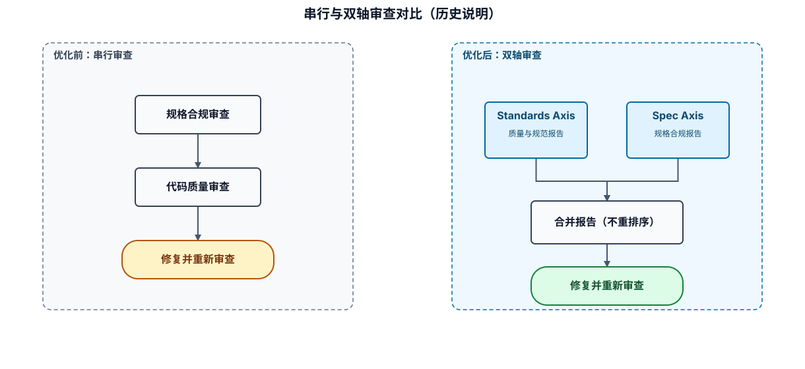
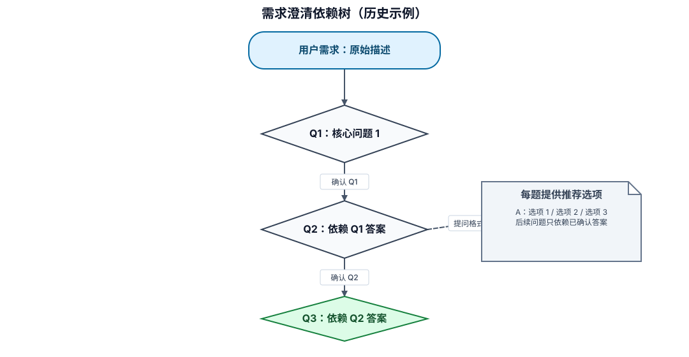
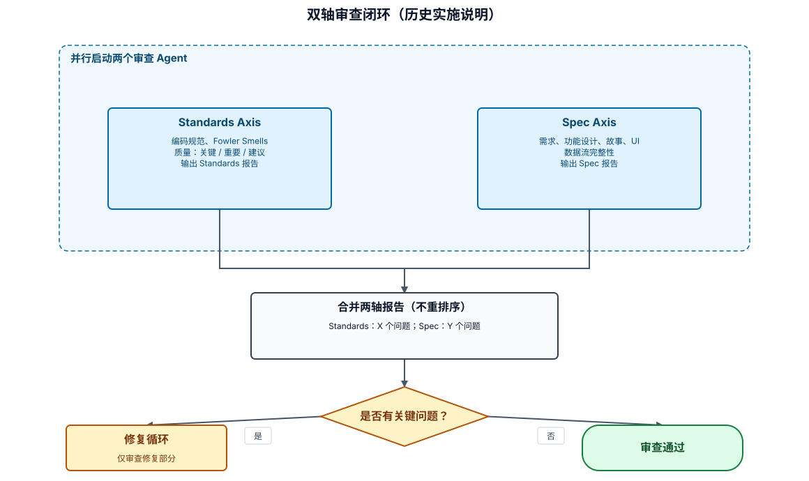

# AI-DLC 优化实施文档

**版本**：1.0
**日期**：2026-07-01
**目标**：整合 grill-me / code-review 优秀能力到 AI-DLC 体系

---

## 目录

1. [背景与目标](#1-背景与目标)
2. [能力差距分析](#2-能力差距分析)
3. [优化方案总览](#3-优化方案总览)
4. [优化一：需求澄清流程](#4-优化一需求澄清流程)
5. [优化二：代码质量审查增强](#5-优化二代码质量审查增强)
6. [优化三：双轴并行审查](#6-优化三双轴并行审查)
7. [文件变更清单](#7-文件变更清单)
8. [实施步骤](#8-实施步骤)
9. [验证清单](#9-验证清单)
10. [回滚方案](#10-回滚方案)

---

## 1. 背景与目标

### 1.1 背景

当前项目同时存在两套开发流程体系：

| 体系 | 适用场景 | 核心能力 |
|------|----------|----------|
| **AI-DLC** | 大型模块开发/重构 | Inception → Construction → Operations |
| **Trellis + grill-me** | 小型优化/修复 | Plan → Execute → Finish + 代码评审 |

两套体系存在重叠，且 grill-me 具备 AI-DLC 缺失的优秀能力：

- **grilling**：系统性需求澄清（逐问题追问、依赖树解析）
- **code-review**：Fowler Smells 基线（11种代码坏味道）、双轴并行审查

### 1.2 目标

**将 grill-me / code-review 优秀能力整合到 AI-DLC**，实现：

1. ✅ Inception 阶段新增系统性需求澄清流程
2. ✅ Construction 阶段代码质量审查整合 Fowler Smells 基线
3. ✅ Construction 阶段两阶段审查改为双轴并行审查
4. ✅ 保持 AI-DLC 现有文档结构和流程完整性

### 1.3 非目标

- ❌ 不改变 AI-DLC 生命周期（Inception/Construction/Operations）
- ❌ 不改变 AI-DLC 文档产出位置（docs/aidlc/）
- ❌ 不改变 AI-DLC 状态跟踪方式（state.md）

---

## 2. 能力差距分析

### 2.1 需求澄清能力对比

| 维度 | grill-me (grilling) | AI-DLC 现有 | 差距 |
|------|---------------------|-------------|------|
| **追问机制** | ✅ 逐问题追问，等待反馈 | ❌ 无系统性追问 | **缺失** |
| **依赖树解析** | ✅ 决策树逐层解析 | ❌ 无结构化分解 | **缺失** |
| **代码探索** | ✅ 可通过探索代码库回答 | ⚠️ 有但非澄清环节 | **弱化** |
| **推荐答案** | ✅ 每个问题提供推荐答案 | ❌ 无 | **缺失** |
| **澄清记录** | ⚠️ 无持久化 | ✅ requirements.md | AI-DLC 更强 |

**结论**：AI-DLC 需求澄清环节缺失系统性追问机制。

### 2.2 代码质量审查能力对比

| 维度 | grill-me (code-review) | AI-DLC 现有 | 差距 |
|------|------------------------|-------------|------|
| **审查基线** | ✅ Fowler Smells (11种) | ⚠️ 关键/重要/建议三级 | **不够具体** |
| **项目规范** | ✅ 自动加载项目规范 | ✅ MCP Skills | 相当 |
| **基线覆盖** | ✅ 项目规范覆盖基线 | ✅ 项目规范优先 | 相当 |
| **问题描述** | ✅ 定义 + 修复建议 | ⚠️ 仅描述问题 | **可增强** |

**结论**：AI-DLC 代码质量审查缺少具体代码坏味道识别基线。

### 2.3 审查流程能力对比

| 维度 | grill-me (code-review) | AI-DLC 现有 | 差距 |
|------|------------------------|-------------|------|
| **审查维度** | ✅ Standards + Spec 双轴 | ✅ 规格合规 + 代码质量 | 相当 |
| **执行方式** | ✅ 并行双 Agent | ❌ 串行两阶段 | **效率低** |
| **报告独立性** | ✅ 两轴独立报告不重排序 | ⚠️ 合并报告 | **可能掩盖问题** |
| **反馈循环** | ⚠️ 无强制循环 | ✅ 审查→修复→重新审查 | AI-DLC 更强 |

**结论**：AI-DLC 审查流程完整但效率可优化（并行化）。

---

## 3. 优化方案总览

### 3.1 优化项汇总

| 优化项 | 整合位置 | 优先级 | 复杂度 |
|--------|----------|--------|--------|
| 需求澄清流程 | Inception 阶段 | P1 | 低 |
| Fowler Smells 基线 | Construction 代码质量审查 | P1 | 低 |
| 双轴并行审查 | Construction 两阶段审查 | P2 | 中 |

### 3.2 优化前后对比

#### Inception 阶段

```
优化前：
用户需求 → requirements.md

优化后：
用户需求 → 需求澄清流程 → requirements.md
```

#### Construction 代码质量审查

```
优化前：
关键问题：逻辑错误/安全漏洞/数据风险/异常处理
重要问题：命名/结构/重复/测试/规范
建议：性能/抽象/文档

优化后：
关键问题：逻辑错误/安全漏洞/数据风险/异常处理
重要问题：Fowler Smells (11种) + 命名/结构/重复/测试/规范
建议：性能/抽象/文档
```

#### Construction 审查流程

```
优化前（串行）：
规格合规审查 → 代码质量审查 → 修复 → 重新审查

优化后（并行）：
```



可审阅源：`assets/historical-diagrams.diagram.json`。图中保留串行审查与双轴审查的历史对比，以及双轴报告不重排序的结论。

---

## 4. 优化一：需求澄清流程

### 4.1 新增文件

**文件路径**：`steering/inception-requirement-clarification.md`

**文件内容**：

````markdown
# 需求澄清流程

## 概述

在 Inception 阶段编写 requirements.md 之前，通过系统性追问澄清用户需求，确保需求完整、准确、无歧义。

**核心原则**：逐问题追问，依赖树解析，推荐答案先行。

---

## 触发时机

| 场景 | 触发条件 |
|------|----------|
| 新模块开发 | 用户描述模糊或存在歧义 |
| 功能优化 | 优化目标/范围不明确 |
| Bug 修复 | 根因/影响范围不清晰 |
| 重构 | 重构动机/目标状态不明确 |

**不触发**：
- 用户需求已非常清晰（有完整 PRD 或详细描述）
- 简单配置修改/文案修改

---

## 澄清流程

### 步骤 1：依赖树分解

将用户需求分解为决策树结构：

````



可审阅源：`assets/historical-diagrams.diagram.json`。图中保留核心问题、依赖关系与推荐选项的历史示例。

````markdown
**分解规则**：
1. 从最核心问题开始（目标/范围）
2. 后续问题依赖前面问题的答案
3. 每个问题都能独立回答（不并发问题）
4. 树深度一般不超过 5 层

### 步骤 2：逐问题追问

**追问规则**：

1. **每次只问一个问题**
   ```
   ❌ 错误：优化目标是什么？优化范围是什么？是否需要缓存？
   ✅ 正确：优化目标是什么？
   ```

2. **提供推荐答案**
   - 先探索代码库，基于现状提供推荐答案
   - 如果无法通过代码探索回答，提供 2-3 个常见选项
   - 推荐 ≠ 强制，用户可选择其他答案

   ```
   Q1: 优化目标是什么？

   推荐答案：查询响应时间 < 200ms (P99)
   （我通过探索代码发现当前 P99 ≈ 500ms，基于业务场景推荐此目标）

   您可以选择：
   A. 采纳推荐答案
   B. 其他（请说明）
   ```

3. **等待用户反馈**
   - 用户确认后再继续下一个问题
   - 如果用户回答模糊，继续追问澄清

4. **代码探索优先**
   - 能通过探索代码库回答的问题，先探索再问
   - 探索结果作为推荐答案的依据

   ```
   Q2: 当前性能瓶颈在哪里？

   探索代码发现：
   - PointAccountServiceImpl.getAccountByMemberId() 存在 N+1 查询
   - 每次查询都访问数据库，无缓存

   推荐答案：数据库查询是主要瓶颈（N+1 查询 + 无缓存）
   ```

### 步骤 3：记录澄清过程

将澄清过程记录到 `inception/requirement-clarification.md`：

```markdown
# 需求澄清记录

**模块**: [模块名称]
**时间戳**: [ISO 时间戳]
**初始需求**: [用户原始描述]

---

## 澄清过程

### Q1: 优化目标是什么？

**推荐答案**: 查询响应时间 < 200ms (P99)
**依据**: 探索代码发现当前 P99 ≈ 500ms
**用户确认**: ✅ 采纳

---

### Q2: 优化范围是什么？

**推荐答案**: PointAccountService + PointRecordService
**依据**: 代码分析显示这两个服务占查询时间 80%
**用户确认**: ✅ 采纳，并补充需要优化 SigninService

---

### Q3: 是否引入缓存？

**推荐答案**: 是，引入 Redis 缓存（当前使用 Caffeine 本地缓存）
**依据**: 配置文件显示 CACHE_TYPE=caffeine，集群环境需切换 Redis
**用户确认**: ✅ 采纳，但需保留 Caffeine 作为二级缓存

---

## 最终需求确认

基于澄清过程，确认以下需求：

### 目标
- 积分查询 P99 < 200ms
- 支持集群环境（缓存一致性）

### 范围
- PointAccountService
- PointRecordService
- SigninService

### 方案
- Redis 缓存（L1）+ Caffeine 缓存（L2）
- Cache-Aside 模式保证一致性

---

## 未解决问题

（如有）

---

## 附录：代码探索发现

### 性能瓶颈分析

1. **N+1 查询**
   - 文件：`PointAccountServiceImpl.java` L45-52
   - 问题：循环查询积分明细

2. **无缓存**
   - 文件：`PointRecordServiceImpl.java` L78
   - 问题：每次查询都访问数据库

### 当前缓存配置

```yaml
# application.yml
loeyae:
  cache:
    type: caffeine  # 本地缓存，不支持集群
```
```

---

## 澄清问题模板

### 目标类问题

```
Q: 优化/开发目标是什么？

推荐答案格式：
- 性能目标：[指标] < [阈值] (当前 [当前值])
- 功能目标：[功能描述]
- 质量目标：[质量属性] 达到 [标准]
```

### 范围类问题

```
Q: 涉及哪些模块/文件/功能？

推荐答案依据：
- 代码探索发现的相关文件
- 依赖分析结果
- 用户历史需求记录
```

### 方案类问题

```
Q: 技术方案是什么？

推荐答案依据：
- 项目现有技术栈
- MCP Skills 编码规范
- 行业最佳实践
```

### 约束类问题

```
Q: 有哪些约束条件？

常见约束：
- 兼容性约束：需兼容 [版本/系统]
- 性能约束：响应时间 < [阈值]
- 安全约束：需满足 [安全标准]
- 时间约束：需在 [日期] 前完成
```

---

## 与 AI-DLC 工作流集成

### 在 Inception 阶段的位置

```
用户需求描述
    ↓
需求澄清流程（本文件）
    ↓
requirements.md
    ↓
user-stories.md / functional-design.md
    ↓
Construction 阶段
```

### 澄清结果复用

澄清过程中的代码探索发现，可复用到：

- `requirements.md` 背景章节
- `functional-design.md` 技术方案章节
- `construction/` 审查时的上下文

---

## 红旗信号

**绝不**：
- 用户需求模糊时直接开始编写 requirements.md
- 一次问多个问题（让用户困惑）
- 不提供推荐答案（增加用户认知负担）
- 不等待用户确认就继续（假设用户意图）
- 忽略代码探索发现（凭空猜测）

---

## 最终规则

```
需求澄清不是可选的。
它是需求质量的基石。
跳过澄清 = 把缺陷留给后续阶段。
```
````

### 4.2 修改文件

**文件路径**：`steering/aidlc-inception.md`（或 Inception 阶段入口文件）

**新增内容**：

```markdown
## Inception 阶段流程

### 1. 需求澄清（新增）
**触发条件**：用户需求模糊或存在歧义
**产出文件**：`inception/requirement-clarification.md`
**详见**：[需求澄清流程](inception-requirement-clarification.md)

### 2. 需求分析
**产出文件**：`inception/requirements.md`
**输入**：需求澄清结果（如有）

### 3. 用户故事
**产出文件**：`inception/user-stories.md`
**输入**：requirements.md

### 4. 功能设计
**产出文件**：`construction/unit-*/functional-design.md`
**输入**：requirements.md + user-stories.md

### 5. 工作流规划
**产出文件**：`inception/workflow.md`
**输入**：requirements.md
```

---

## 5. 优化二：代码质量审查增强

### 5.1 修改文件

**文件路径**：`steering/construction-code-review.md`

**修改内容**：

**原章节**：

```markdown
### 阶段 2：代码质量审查

**目的**：确保代码质量、可维护性和安全性。

**前置条件**：规格合规审查必须先通过。

**审查维度**：

#### 关键问题（必须修复，阻塞继续）

| 类别 | 检查项 |
|------|--------|
| 逻辑错误 | 条件判断错误、循环边界错误、空指针风险 |
| 安全漏洞 | SQL 注入、XSS、未授权访问、敏感数据泄露 |
| 数据风险 | 数据丢失可能、并发问题、事务不完整 |
| 异常处理 | 未捕获异常、异常吞没、错误的异常类型 |

#### 重要问题（应该修复）

| 类别 | 检查项 |
|------|--------|
| 命名 | 变量/方法/类命名不清晰或不符合规范 |
| 结构 | 方法过长、类职责不单一、层次混乱 |
| 重复 | 代码重复、可提取的公共逻辑 |
| 测试 | 测试覆盖不足、测试质量差、缺少边界测试 |
| 规范 | 违反团队编码规范（Loeyae Boot / Vue 3） |

#### 建议（可选修复）

| 类别 | 检查项 |
|------|--------|
| 性能 | 可优化的查询、不必要的循环、缓存机会 |
| 抽象 | 更好的设计模式、更清晰的抽象层次 |
| 文档 | 复杂逻辑缺少注释、公共 API 缺少文档 |
```

**新章节**：

```markdown
### 阶段 2：代码质量审查（增强版）

**目的**：确保代码质量、可维护性和安全性。

**前置条件**：规格合规审查必须先通过。

**审查维度**：

#### 关键问题（必须修复，阻塞继续）

| 类别 | 检查项 |
|------|--------|
| 逻辑错误 | 条件判断错误、循环边界错误、空指针风险 |
| 安全漏洞 | SQL 注入、XSS、未授权访问、敏感数据泄露 |
| 数据风险 | 数据丢失可能、并发问题、事务不完整 |
| 异常处理 | 未捕获异常、异常吞没、错误的异常类型 |

#### 重要问题（应该修复）

**Fowler 代码 Smells 基线**（11种）：

| Smell | 定义 | 识别方法 | 修复建议 |
|-------|------|----------|----------|
| **Mysterious Name** | 变量/方法/类命名不揭示意图 | 名称无法回答"它是什么/做什么" | 重命名；若无诚实名称则设计有问题 |
| **Duplicated Code** | 相同逻辑形状在多处出现 | 相同代码块在 diff 中多次出现 | 提取公共方法/类，两处调用 |
| **Feature Envy** | 方法更多访问其他对象数据而非自身 | 方法调用 `other.getX()` 多于 `this.getX()` | 将方法移到它羡慕的数据所在类 |
| **Data Clumps** | 相同字段/参数总是成组出现 | 多处出现相同参数组合（如 userId, userName） | 封装为独立类型（UserContext） |
| **Primitive Obsession** | 基本类型代表应独立类型的领域概念 | 使用 String/Integer 代表领域概念（如 Phone） | 创建领域小类型（PhoneNumber） |
| **Repeated Switches** | 相同的 switch/if-cascade 在多处重复 | 相同条件判断在多个方法/类中重复 | 用多态或共享 Map 替代 |
| **Shotgun Surgery** | 一个逻辑变更导致多处分散修改 | 修改一个功能需改动 5+ 文件 | 将变更聚合到一个模块 |
| **Divergent Change** | 一个模块因多个无关原因被修改 | 一个类有多个变更原因（如"用户"+"订单"） | 拆分模块，单一变更原因 |
| **Speculative Generality** | 为规格未要求的未来需求添加抽象 | 参数/抽象无实际调用者 | 删除，内联回归直到真实需求出现 |
| **Message Chains** | 长 `a.b().c().d()` 调用链 | 链式调用超过 3 层 | 在第一个对象后隐藏导航方法 |
| **Middle Man** | 类/函数仅做委托转发 | 类方法仅 `return other.method()` | 删除中间层，直接调用目标 |

**项目规范覆盖**：
- 以上 Smells 为基线判断
- 项目编码规范（MCP Skills + CLAUDE.md）优先
- 项目规范明确允许的情况，不标记为 Smell

**其他重要问题**：

| 类别 | 检查项 |
|------|--------|
| 命名 | 违反团队命名规范（Loeyae Boot / Vue 3） |
| 结构 | 方法过长（> 50行）、类职责不单一、层次混乱 |
| 测试 | 测试覆盖不足、测试质量差、缺少边界测试 |

#### 建议（可选修复）

| 类别 | 检查项 |
|------|--------|
| 性能 | 可优化的查询、不必要的循环、缓存机会 |
| 抽象 | 更好的设计模式、更清晰的抽象层次 |
| 文档 | 复杂逻辑缺少注释、公共 API 缺少文档 |

---

#### 审查报告格式（增强版）

```markdown
## 代码质量审查结果

**状态**：✅ 通过 | ⚠️ 需要修复

### 优点
- [做得好的地方，具体引用代码]

### 问题

**[关键]** — 必须修复
1. 文件：`path/to/file.java` L42
   问题：[描述]
   建议：[修复方案]

**[重要 — Smell: Feature Envy]**
1. 文件：`PointRecordServiceImpl.java` L78
   问题：getRecords() 方法频繁访问 PointAccount 数据（ envy 目标：PointAccount）
   建议：将积分计算逻辑移到 PointAccountService.getAccountBalance()

**[重要 — Smell: Duplicated Code]**
1. 文件：`AdminPointController.java` L45 + `AppPointController.java` L32
   问题：两处相同的积分计算逻辑（15行代码重复）
   建议：提取 PointCalculator 工具类

**[重要 — 其他]**
1. 文件：`path/to/file.java` L78
   问题：[描述]
   建议：[修复方案]

**[建议]** — 可选
1. [描述 + 建议]

### 评估
- 关键问题：X 个（必须全部修复）
- 重要问题：X 个（建议全部修复）
  - Smells: X 个
  - 其他: X 个
- 建议：X 个（自行决定）

**结论**：可以继续 | 需要修复后重新审查
```
```

### 5.2 审查示例

**示例：识别 Feature Envy**

```java
// PointRecordServiceImpl.java
public BigDecimal calculateBalance(Long memberId) {
    // Feature Envy: 频繁访问 pointAccount 数据
    PointAccount account = pointAccountRepository.findById(memberId);
    List<PointRecord> records = pointRecordRepository.findByAccountId(account.getId());
    BigDecimal balance = account.getInitialBalance(); // 访问 account 数据
    for (PointRecord record : records) {
        balance = balance.add(record.getAmount()); // 访问 record 数据
    }
    return balance;
}
```

**审查报告**：

```markdown
**[重要 — Smell: Feature Envy]**
文件：`PointRecordServiceImpl.java` L78-85
问题：calculateBalance() 方法主要访问 PointAccount 和 PointRecord 数据，
      但定义在 PointRecordServiceImpl 中，envious of PointAccount
建议：将方法移到 PointAccountService，签名改为：
      PointAccountService.calculateBalance(Long memberId)
```

---

## 6. 优化三：双轴并行审查

### 6.1 修改文件

**文件路径**：`steering/construction-code-review.md`

**修改内容**：

**原章节**：

```markdown
## 两阶段审查流程

### 阶段 1：规格合规审查
...

### 阶段 2：代码质量审查
...
```

**新章节**：

````markdown
## 双轴并行审查流程（优化版）

### 审查模式

采用 **并行双轴审查**，两个审查 Agent 独立运行，互不干扰：

````



可审阅源：`assets/historical-diagrams.diagram.json`。图中保留双轴独立报告、合并后关键问题分流与仅复审修复部分的历史说明。

````markdown
### Standards Axis 审查清单

**目的**：验证代码是否符合项目规范和质量标准。

```markdown
## Standards Axis 审查清单

### 关键问题（必须修复）

- [ ] 无逻辑错误（条件判断、循环边界、空指针）
- [ ] 无安全漏洞（SQL 注入、XSS、未授权访问）
- [ ] 无数据风险（数据丢失、并发问题、事务完整性）
- [ ] 异常处理完整（无未捕获异常、无异常吞没）

### 重要问题（应该修复）

**Fowler Smells 基线**：
- [ ] 无 Mysterious Name
- [ ] 无 Duplicated Code
- [ ] 无 Feature Envy
- [ ] 无 Data Clumps
- [ ] 无 Primitive Obsession
- [ ] 无 Repeated Switches
- [ ] 无 Shotgun Surgery
- [ ] 无 Divergent Change
- [ ] 无 Speculative Generality
- [ ] 无 Message Chains
- [ ] 无 Middle Man

**项目规范**：
- [ ] 符合 Loeyae Boot 编码规范
- [ ] 符合 CLAUDE.md 约定
- [ ] 方法长度 < 50 行
- [ ] 测试覆盖关键路径

### 建议（可选）

- [ ] 性能可优化点
- [ ] 抽象可改进点
- [ ] 文档可补充点
```

### Spec Axis 审查清单

**目的**：验证实现是否完全匹配规格要求。

```markdown
## Spec Axis 审查清单

### 完整性（缺失检查）

- [ ] 需求文档中的每个功能点都已实现
- [ ] 用户故事中的每个验收标准都已满足
- [ ] 接口契约中定义的每个端点/方法都已实现
- [ ] 错误处理覆盖了规格中定义的所有异常场景

### 准确性（偏差检查）

- [ ] 实现的行为与规格描述一致
- [ ] 数据模型与功能设计一致
- [ ] API 响应格式与契约一致
- [ ] 业务规则的实现与需求描述一致

### 无多余（过度实现检查）

- [ ] 没有添加规格未要求的功能
- [ ] 没有添加规格未要求的参数/字段
- [ ] 没有添加规格未要求的端点
- [ ] 没有"顺便"做的改进

### 接口契约合规

- [ ] 模块间调用符合 contracts.md 定义
- [ ] 请求/响应格式与契约一致
- [ ] 错误码与契约定义一致

### UI Mock 合规（条件：该单元涉及前端页面且存在 UI Mock）

- [ ] 页面结构与 UI Mock HTML 原型布局一致
- [ ] 表单字段与 UI Mock 定义一致
- [ ] 操作按钮和交互行为覆盖 UI Mock 中定义的所有用户操作
- [ ] 列表/表格的列定义与 UI Mock 展示一致

### 数据流完整性（强制）

- [ ] 每个数据读取操作都有对应的真实写入来源
- [ ] 依赖其他模块/单元的数据，该模块/单元已实现或在本次范围内
- [ ] 外部接口数据源已确认可用
- [ ] 初始/种子数据的准备方案已落实
- [ ] 列表/查询页面对应的数据写入入口已实现
```

### 审查报告格式（双轴）

```markdown
## 代码审查报告 — [单元名称]

**时间戳**: [ISO 时间戳]
**审查模式**: 并行双轴审查
**审查范围**: [文件列表或 diff 范围]

---

## Standards Axis

**状态**: ✅ 通过 | ⚠️ 需要修复

### 关键问题
1. **[Security]** `AdminPointController.java` L45
   问题：缺少 @PreAuthorize 权限注解
   建议：添加 @PreAuthorize("hasPermission('point:account:query')")

### 重要问题
1. **[Smell: Feature Envy]** `PointRecordServiceImpl.java` L78
   问题：getRecords() 方法频繁访问 PointAccount 数据
   建议：将积分计算逻辑移到 PointAccountService

2. **[Smell: Duplicated Code]** `AdminPointController.java` L45 + `AppPointController.java` L32
   问题：两处相同的积分计算逻辑
   建议：提取 PointCalculator 工具类

### 建议
1. **[Performance]** 可添加积分余额本地缓存（Caffeine L2）

---

## Spec Axis

**状态**: ✅ 合规 | ❌ 不合规

### 完整性
- ✅ 需求文档中的每个功能点都已实现
- ✅ 用户故事验收标准全部满足

### 无多余
- ✅ 无规格未要求的功能

### 数据流完整性
- ✅ 每个数据读取有对应写入来源
- ✅ 依赖模块已实现

---

## 总结

- **Standards**: 3 个问题（1 关键 + 2 重要 + 1 建议）
- **Spec**: 0 个问题
- **最严重问题**: [Security] 缺少权限注解（Standards Axis）

**结论**: ⚠️ 需要修复后重新审查

**修复要求**：
1. 添加权限注解（关键）
2. 重构积分计算逻辑（重要）
3. 提取公共代码（重要）
```

---

### 修复循环

```
审查发现问题
    ↓
实现者修复
    ↓
重新审查（仅审查修复部分 + 修复是否引入新问题）
    ↓
通过？→ 继续
未通过？→ 回到修复
```

**规则**：
- 关键问题 = 必须修复 = 必须重新审查
- 重要问题 = 建议修复 = 用户决定是否修复
- 重新审查仅检查修复部分，不重新审查已通过部分
- 修复引入新问题 → 标记为新问题，继续修复循环

---

### 双轴独立性

**为什么两轴独立报告，不重排序？**

1. **问题性质不同**
   - Standards 问题：代码质量问题
   - Spec 问题：需求偏差问题

2. **避免掩盖**
   - Standards 通过但 Spec 失败 → 需求未满足
   - Spec 通过但 Standards 失败 → 代码质量差
   - 合并排序可能掩盖某轴问题

3. **修复优先级独立**
   - Standards 关键问题立即修复
   - Spec 缺失问题立即补充
   - 不应因为某轴问题少而忽视

**示例**：

```
❌ 错误合并排序：
1. [Security] 缺少权限注解（Standards 关键）
2. [Spec] 缺少导出功能（Spec 缺失）
3. [Smell] Duplicated Code（Standards 重要）

✅ 正确双轴报告：
Standards: 2 个问题（1 关键 + 1 重要）
Spec: 1 个问题（1 缺失）
最严重问题: [Security] 缺少权限注解（Standards）
```

---

### 与 AI-DLC 工作流的集成

```
代码生成 — TDD 执行阶段
    ↓ 每个单元完成
双轴并行审查（本文件）
    ↓ Standards + Spec 双轴通过
标记单元完成，进入下一个单元
    ↓ 所有单元完成
最终全局审查
    ↓ 全局审查通过
构建和测试
```

---

### 审查记录

审查结果记录到对应的审计文件：

```markdown
## 代码审查 — 单元 X

**时间戳**: [ISO 时间戳]
**审查模式**: 并行双轴审查
**Standards 结果**: ⚠️ 需要修复
**Spec 结果**: ✅ 合规
**Standards 问题**: 关键 1 个, 重要 2 个, 建议 1 个
**Spec 问题**: 0 个
**修复状态**: 已修复并重新审查通过
```
````

### 6.2 实施说明

**并行审查实现方式**：

1. **使用 Agent 工具**：在支持子 Agent 的平台，使用两个并行 Agent

```
// 伪代码示例
parallel([
  agent("Standards Axis 审查", standardsPrompt),
  agent("Spec Axis 审查", specPrompt)
])
```

2. **不支持并行的平台**：串行执行但独立报告

```
standardsReport = reviewStandards()
specReport = reviewSpec()
// 独立报告，不合并排序
```

---

## 7. 文件变更清单

### 7.1 新增文件

| 文件路径 | 说明 | 优先级 |
|----------|------|--------|
| `steering/inception-requirement-clarification.md` | 需求澄清流程 | P1 |

### 7.2 修改文件

| 文件路径 | 修改内容 | 优先级 |
|----------|----------|--------|
| `steering/construction-code-review.md` | 整合 Fowler Smells + 双轴并行审查 | P1 |
| `steering/aidlc-inception.md`（或 Inception 入口） | 新增需求澄清环节 | P1 |

### 7.3 可选更新

| 文件路径 | 更新内容 | 优先级 |
|----------|----------|--------|
| `plugin.yaml` | 新增 `aidlc-code-review` skill 定义 | P2 |
| `docs/aidlc/state.md` | 记录优化实施时间 | P3 |

---

## 8. 实施步骤

### 8.1 准备阶段

```bash
# 1. 备份现有文件
cp steering/construction-code-review.md steering/construction-code-review.md.bak

# 2. 确认 loeyae-aidlc 版本
cat plugin.yaml | grep version
```

### 8.2 实施顺序

**阶段 1：需求澄清流程（P1）**

```bash
# 1. 创建需求澄清文档
touch steering/inception-requirement-clarification.md

# 2. 写入完整内容（见第4节）

# 3. 更新 Inception 入口文件
# 在 aidlc-inception.md 中添加需求澄清环节
```

**阶段 2：代码质量审查增强（P1）**

```bash
# 1. 编辑 construction-code-review.md
# 在"阶段 2：代码质量审查"章节中：
#   - 新增 Fowler Smells 基线（11种）
#   - 更新审查报告格式

# 2. 验证格式正确性
grep "Fowler Smells" steering/construction-code-review.md
```

**阶段 3：双轴并行审查（P2）**

```bash
# 1. 编辑 construction-code-review.md
# 将"两阶段审查流程"章节改为"双轴并行审查流程"

# 2. 添加双轴审查清单

# 3. 更新审查报告格式
```

**阶段 4：验证与记录（P3）**

```bash
# 1. 测试优化后的流程
# 使用一个示例模块验证需求澄清 + 双轴审查

# 2. 记录实施状态
# 在 docs/aidlc/state.md 中记录优化实施时间
```

### 8.3 实施检查点

| 检查点 | 验证命令 | 预期结果 |
|--------|----------|----------|
| 需求澄清文档创建 | `ls steering/inception-requirement-clarification.md` | 文件存在 |
| Fowler Smells 整合 | `grep "Feature Envy" steering/construction-code-review.md` | 找到定义 |
| 双轴审查整合 | `grep "Standards Axis" steering/construction-code-review.md` | 找到章节 |
| Inception 入口更新 | `grep "需求澄清" steering/aidlc-inception.md` | 找到环节 |

---

## 9. 验证清单

### 9.1 功能验证

**需求澄清验证**：

```markdown
测试场景：用户提出模糊需求

用户输入：我要优化积分体系

AI 应触发需求澄清流程：
Q1: 优化目标是什么？
推荐答案：查询响应时间 < 200ms (P99)
...

✅ 验证通过：AI 逐问题追问并提供推荐答案
```

**Fowler Smells 验证**：

```markdown
测试场景：代码存在 Feature Envy

代码：
public class PointRecordServiceImpl {
    public BigDecimal calculateBalance(Long memberId) {
        PointAccount account = pointAccountRepository.findById(memberId);
        // ... 频繁访问 account 数据
    }
}

AI 审查报告应包含：
**[重要 — Smell: Feature Envy]**
问题：calculateBalance() 方法 envious of PointAccount
建议：将方法移到 PointAccountService

✅ 验证通过：AI 识别 Smell 并提供修复建议
```

**双轴并行验证**：

```markdown
测试场景：代码同时存在质量问题 and 规格偏差

代码问题：
1. 缺少权限注解（Standards 关键）
2. 缺少导出功能（Spec 缺失）

AI 审查报告格式：
## Standards Axis
**状态**: ⚠️ 需要修复
...

## Spec Axis
**状态**: ❌ 不合规
...

✅ 验证通过：双轴独立报告，不合并排序
```

### 9.2 兼容性验证

```markdown
验证项：
- [ ] AI-DLC Inception 阶段流程完整（需求澄清 → requirements.md → user-stories.md）
- [ ] AI-DLC Construction 阶段流程完整（双轴审查 → 修复 → 重新审查）
- [ ] docs/aidlc/ 文档结构不变
- [ ] state.md 状态跟踪方式不变
- [ ] MCP Skills 编码规范加载正常
```

---

## 10. 回滚方案

### 10.1 文件回滚

```bash
# 恢复备份文件
cp steering/construction-code-review.md.bak steering/construction-code-review.md

# 删除新增文件
rm steering/inception-requirement-clarification.md

# 恢复 Inception 入口
# 手动移除需求澄清环节
```

### 10.2 部分回滚

**仅回滚双轴并行审查**：

```bash
# 恢复"两阶段审查流程"章节
# 保留 Fowler Smells 基线
```

**仅回滚需求澄清**：

```bash
rm steering/inception-requirement-clarification.md
# 移除 Inception 入口中的需求澄清环节
```

---

## 附录 A：完整审查报告示例

```markdown
## 代码审查报告 — Member 积分体系优化

**时间戳**: 2026-07-01T14:30:00+08:00
**审查模式**: 并行双轴审查
**审查范围**:
- loeyae-module-member/loeyae-module-member-biz/src/main/java/com/loeyae/dev/module/member/biz/service/point/
- loeyae-module-member/loeyae-module-member-biz/src/main/java/com/loeyae/dev/module/member/biz/controller/app/point/

---

## Standards Axis

**状态**: ⚠️ 需要修复

### 关键问题

1. **[Security]** `AppPointController.java` L45
   问题：`getAccount()` 接口缺少权限校验，任何登录用户可查询任意会员积分
   建议：添加 `@PreAuthorize("hasPermission('point:account:query')")` 或校验 `authUser.getId() == memberId`

### 重要问题

1. **[Smell: Feature Envy]** `PointRecordServiceImpl.java` L78-85
   问题：`calculateBalance()` 方法频繁访问 `PointAccount` 数据（调用 `account.getId()`, `account.getInitialBalance()`）
   建议：将方法移到 `PointAccountService`，签名改为 `PointAccountService.calculateBalance(Long memberId)`

2. **[Smell: Duplicated Code]** `AdminPointController.java` L52-67 + `AppPointController.java` L38-53
   问题：两处相同的积分计算逻辑（15行代码重复）
   建议：提取 `PointCalculator` 工具类，两处调用

3. **[Smell: Data Clumps]** `PointRecordServiceImpl.java` L90, L105, L120
   问题：`memberId`, `userName`, `userPhone` 三个参数在多个方法中成组出现
   建议：封装为 `MemberContext` 类型

### 建议

1. **[Performance]** `PointAccountServiceImpl.java` L32
   问题：每次查询都访问数据库，无缓存
   建议：添加 Redis 缓存（L1）+ Caffeine 缓存（L2）

2. **[Abstraction]** `PointRuleServiceImpl.java`
   问题：积分规则计算使用大量 if-else
   建议：考虑策略模式重构

---

## Spec Axis

**状态**: ✅ 合规

### 完整性
- ✅ FR-MEM-POINT-001 积分查询：已实现 `AppPointController.getAccount()`
- ✅ FR-MEM-POINT-002 每日签到：已实现 `AppSigninController.signin()`
- ✅ FR-MEM-POINT-003 积分抵扣：已实现 `AppPointController.deduct()`
- ✅ FR-MEM-POINT-004 积分兑换：已实现 `AppPointController.exchange()`
- ✅ FR-MEM-POINT-005 规则配置：已实现 `AdminPointRuleController` CRUD
- ✅ FR-MEM-POINT-006 管理员调整：已实现 `AdminPointAccountController.adjust()`

### 准确性
- ✅ API 响应格式与 `functional-design.md` 一致
- ✅ 积分计算规则与需求描述一致

### 无多余
- ✅ 无规格未要求的功能

### 数据流完整性
- ✅ 积分账户数据由签到/兑换/调整接口写入
- ✅ 积分规则数据由管理端 CRUD 写入
- ✅ 初始化数据由 `V1.10.0__InitMemberPoint.sql` 提供

---

## 总结

- **Standards**: 4 个问题（1 关键 + 3 重要 + 2 建议）
- **Spec**: 0 个问题
- **最严重问题**: [Security] 权限校验缺失（Standards Axis）

**结论**: ⚠️ 需要修复后重新审查

**修复要求**：
1. 添加权限校验（关键，必须修复）
2. 重构积分计算逻辑（重要，建议修复）
3. 提取公共代码（重要，建议修复）
4. 封装参数对象（重要，建议修复）
```

---

## 附录 B：需求澄清示例

```markdown
# 需求澄清记录

**模块**: Member 积分体系优化
**时间戳**: 2026-07-01T10:00:00+08:00
**初始需求**: 我要优化积分体系性能

---

## 澄清过程

### Q1: 优化目标是什么？

**推荐答案**: 查询响应时间 < 200ms (P99)
**依据**: 探索代码发现当前 P99 ≈ 500ms，基于用户体验标准推荐
**用户确认**: ✅ 采纳

---

### Q2: 优化范围是什么？

**推荐答案**: PointAccountService + PointRecordService
**依据**: 性能分析显示这两个服务占查询时间 80%
**用户确认**: ✅ 采纳，并补充需要优化 SigninService

---

### Q3: 是否引入缓存？

**推荐答案**: 是，引入 Redis 缓存（当前使用 Caffeine 本地缓存）
**依据**: 配置文件显示 `CACHE_TYPE=caffeine`，集群环境需切换 Redis
**用户确认**: ✅ 采纳，但需保留 Caffeine 作为二级缓存

---

### Q4: 缓存一致性策略？

**推荐答案**: Cache-Aside 模式（先更新数据库，再删除缓存）
**依据**: 积分变更频率低，最终一致性可接受
**用户确认**: ✅ 采纳

---

### Q5: 是否需要优化 N+1 查询？

**推荐答案**: 是，使用 MPJ 关联查询优化
**依据**: `PointAccountServiceImpl.getAccountByMemberId()` 存在 N+1 查询
**用户确认**: ✅ 采纳

---

## 最终需求确认

### 目标
- 积分查询 P99 < 200ms
- 支持集群环境（缓存一致性）

### 范围
- PointAccountService
- PointRecordService
- SigninService

### 方案
- Redis 缓存（L1）+ Caffeine 缓存（L2）
- Cache-Aside 模式保证一致性
- MPJ 关联查询消除 N+1

### 验收标准
- [ ] JMeter 压测 P99 < 200ms
- [ ] SQL 慢查询日志无 N+1
- [ ] 集群环境缓存一致性测试通过

---

## 附录：代码探索发现

### 性能瓶颈分析

1. **N+1 查询**
   - 文件：`PointAccountServiceImpl.java` L45-52
   - 问题：循环查询积分明细

2. **无缓存**
   - 文件：`PointRecordServiceImpl.java` L78
   - 问题：每次查询都访问数据库

### 当前缓存配置

```yaml
# application.yml
loeyae:
  cache:
    type: caffeine  # 本地缓存，不支持集群
```
```

---

**文档结束**

**版本历史**：

| 版本 | 日期 | 变更内容 |
|------|------|----------|
| 1.0 | 2026-07-01 | 初始版本：整合 grill-me 能力到 AI-DLC |
