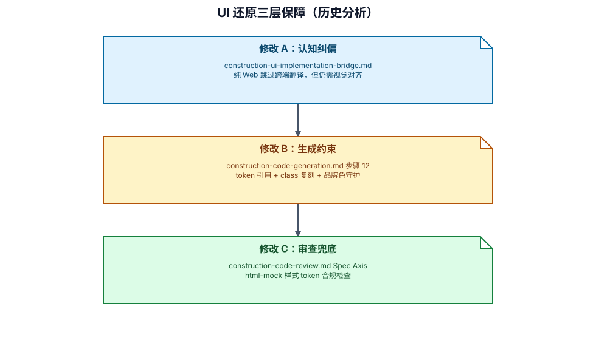

# AI-DLC 流程缺陷分析：Construction 阶段 UI 视觉还原遗漏

> 日期：2026-08-18
> 触发事件：`http://localhost:8890/order/list` 与 `html_glm5.2/18-my-service-orders.html` 视觉差异巨大
> 影响范围：as-shop-pc 前端项目 product / invitation / order 三个模块共 12 个页面/组件文件

---

## 一、问题描述

### 1.1 现象

订单列表页面（`/order/list`）的实际运行效果与 HTML Mock 设计稿（`html_glm5.2/18-my-service-orders.html`）存在严重视觉差异：

| 维度 | 设计稿 (HTML Mock) | 实际实现 |
|------|-------------------|---------|
| 整体布局 | Account Layout（左侧 sidebar + 右侧 main） | 独立页面（纯居中 max-width: 800px） |
| 卡片圆角 | `border-radius: 32px` | `border-radius: 12px` |
| 卡片结构 | 三栏（图片160x120 + 结构化详情 + 金额&按钮） | 两栏（图片80x80 + 简化信息 + 底部按钮） |
| Header | 商品名(左) + 订单号+状态(右) | 订单号(左) + 状态(右) |
| 品牌色 | `#FFBFD5` 粉色 / `#FF528D` 玫红 | `#f5a623` 橙色 |
| 字体 | `Brygada 1918` (--font-primary) | 系统默认字体 |
| 按钮 | 胶囊形 `border-radius: 100px` + 2px 粗边框 | 小圆角 `border-radius: 6px` |
| Tab | 胶囊容器 + pill 按钮 | 下划线 Tab |
| 金额字号 | 28px 粗体 | 16px 粗体 |
| 设计 token | 全部引用 CSS Variables | 全部硬编码 |

### 1.2 全面排查结果

经排查，此问题不仅存在于 order 模块，product 和 invitation 模块同样存在：

| 模块 | 端 | 是否有 UI Mock | 存在遗漏？ | 严重程度 |
|------|------|--------------|-----------|---------|
| **product** | as-shop-pc | 有（7 个 HTML Mock） | 详情页严重偏离 | 高 |
| **invitation** | as-shop-pc | 有（13 个 HTML Mock） | 大部分页面偏离 | 高 |
| **order** | as-shop-pc | 有（3 个 HTML Mock） | 全面偏离 | 高 |
| **merchant** | as-shop-merchant | 无 Mock 基准 | 不适用 | N/A |

### 1.3 受影响文件清单

| # | 模块 | 文件 | 问题简述 |
|---|------|------|---------|
| 1 | order | `list/OrderListPage.vue` | 缺 account-layout，全面自创样式 |
| 2 | order | `components/OrderCard.vue` | 卡片结构完全不同，零 token |
| 3 | order | `components/OrderBatchGroup.vue` | 聚合结构不符 |
| 4 | order | `components/OrderStatusTabs.vue` | Tab 样式完全不同 |
| 5 | order | `detail/OrderDetailPage.vue` | 零 token，自创色值 |
| 6 | product | `venues/VenueDetailPage.vue` | 全蓝色调（#1a73e8），零 token |
| 7 | product | `themes/ThemeDetailPage.vue` | 同上 |
| 8 | invitation | `my-invitations/MyInvitationsPage.vue` | EP 色值，无品牌色，错圆角 |
| 9 | invitation | `components/InvitationCard.vue` | EP 色值，shadow，错圆角 |
| 10 | invitation | `components/InvitationStatusTabs.vue` | 散列 pill vs 应为胶囊容器 |
| 11 | invitation | `guest-cards/GuestCardsPage.vue` | EP 色值，错圆角 |
| 12 | invitation | `guest-cards/components/GuestCardItem.vue` | EP 蓝色 #409EFF 替代品牌色 |

### 1.4 责任归属

| 责任方 | 比重 | 原因 |
|--------|------|------|
| **AI（执行者）** | **80%** | 代码生成时有明确的 Mock 来源指引却未参照执行，属于执行失职 |
| **AI-DLC 流程设计** | **20%** | 流程规则的措辞有歧义，形成"合法跳过链"，使 AI 能在每一步都找到"不需要视觉对齐"的正当理由 |

---

## 二、断裂链路还原

### 2.1 完整执行链路中的断点

问题不是单点故障，而是 **3 个 steering 文件形成的一条"合法跳过链"**。纯 Web + html-mock 模式组合下，AI 在每一步都能找到"跳过视觉对齐"的流程依据：

```
步骤 1.5（前端平台规范门禁）
  → 跳过条件明确写了："纯 Web 项目"
  → AI 合法跳过 ✓

步骤 2（MCP Skill 加载 / 前端代码）
  → "跨端项目 → 加载 construction-ui-implementation-bridge.md"
  → 纯 Web 不触发此条
  → AI 合法不加载 ✓

  → "state.md UI 设计方式 = figma → 加载 common-figma-design-standards.md"
  → html-mock 模式不触发此条
  → AI 合法不加载 ✓
  
步骤 12（Mock 读取规则）
  → 触发条件："当前步骤为页面/组件生成且存在页面对照表"
  → 规则约束了：区域顺序、表单字段、按钮列表、条件渲染
  → 完全没有约束"样式值"（色值/圆角/字号/间距/字体/token）
  → 盲区 ✓
  
construction-ui-implementation-bridge.md（适用条件）
  → "纯 Web 项目（PC 端 Vue3 等）：跳过本流程"
  → AI 合法跳过整个文件 ✓
  → 第四部分"代码审查扩展"标注"对前端跨端项目增加"
  → 纯 Web 不适用
  → AI 合法跳过 ✓
  
construction-code-review.md（Spec Axis / UI 设计合规）
  → 检查项存在且正确："页面结构与设计基准的布局一致"
  → 但只检查：结构/字段/按钮/状态展示/条件渲染/响应式
  → figma 模式有附加项："颜色、间距、字体使用项目 token"
  → html-mock 模式无此附加项
  → 盲区 ✓
```

### 2.2 断裂链路示意图

```
                    ┌─────────────────────────────────┐
                    │  Inception 产出 HTML Mock        │
                    │  (style-anchor.css + 页面 HTML)  │
                    └──────────────┬──────────────────┘
                                   │
                    ┌──────────────▼──────────────────┐
                    │  Construction 步骤 1.5           │
                    │  前端平台规范门禁                 │
                    │  → "纯 Web 跳过" ← 合法跳过     │
                    └──────────────┬──────────────────┘
                                   │
                    ┌──────────────▼──────────────────┐
                    │  Construction 步骤 2             │
                    │  MCP Skill 加载                  │
                    │  → bridge.md "纯 Web 跳过"       │
                    │  → figma-standards "非 figma 跳过"│
                    │  ← 样式对齐规则从未被加载         │
                    └──────────────┬──────────────────┘
                                   │
                    ┌──────────────▼──────────────────┐
                    │  Construction 步骤 12            │
                    │  Mock 读取规则                    │
                    │  → 约束：结构/字段/按钮/条件渲染  │
                    │  → 不约束：样式值/色值/圆角/token │
                    │  ← AI 只还原了结构，自创了样式    │
                    └──────────────┬──────────────────┘
                                   │
                    ┌──────────────▼──────────────────┐
                    │  Construction 代码审查           │
                    │  Spec Axis - UI 设计合规         │
                    │  → html-mock 无"样式 token"检查项│
                    │  ← 审查也无法兜住样式偏离         │
                    └──────────────┬──────────────────┘
                                   │
                    ┌──────────────▼──────────────────┐
                    │  最终产出：                       │
                    │  功能正确 ✓ 视觉完全脱轨 ✗       │
                    └─────────────────────────────────┘
```

### 2.3 核心矛盾点

`construction-ui-implementation-bridge.md` 中的一句话：

> **纯 Web 项目**（PC 端 Vue3、React SPA 等）：CSS 语义与设计产物一致，无需翻译层，跳过本流程。

这句话的**本意**是：纯 Web 的 CSS 可以直接使用，不需要像 Taro/RN 那样做"CSS → 平台原语"的翻译。

但**实际效果**是：AI 将"跳过本流程"理解为"不需要任何 UI 设计对齐工作"，从而在代码生成时完全忽略 Mock 中的样式定义。

---

## 三、结论

### 3.1 纯 Web + html-mock 模式下，现有流程在以下维度完全无约束

1. **样式值对齐**：色值、圆角、字号、间距、字体值必须与 Mock CSS 一致 — 无规则约束
2. **设计 token 引用**：项目有全局 CSS Variables 时必须引用而非硬编码 — 无规则约束
3. **全局 class 复刻**：Mock 中已定义的样式 class 必须被逐属性复刻 — 无规则约束
4. **品牌色守护**：禁止用 UI 框架默认色替代品牌色 — 无规则约束

### 3.2 根因分类

| 根因类型 | 具体表现 |
|---------|---------|
| 措辞歧义 | "跳过本流程"被理解为"不需要视觉对齐" |
| 规则缺失 | 步骤 12 Mock 读取规则只约束结构，不约束样式 |
| 审查盲区 | html-mock 模式无"样式 token"检查项（figma 有） |

### 3.3 为什么 figma 模式没有此问题

`construction-code-review.md` 中 figma 模式有明确的附加检查项：

> **figma 模式附加检查**：
> - [ ] 颜色、间距、字体使用项目 token，未直接硬编码 `get_design_context` 返回的 Tailwind 字面值

html-mock 模式缺少对等的检查项，这是设计时的疏忽——两种模式都需要样式对齐，只是表达方式不同。

---

## 四、修改建议

### 4.1 概述

需要修改 **3 个 steering 文件**，新增 **0 个文件**。三处修改形成"生成约束 + 认知纠偏 + 审查兜底"的闭环。

### 4.2 修改 A：`construction-ui-implementation-bridge.md`

**位置**：「适用条件」区块末尾

**现有原文**：

```markdown
**纯 Web 项目**（PC 端 Vue3、React SPA 等）：CSS 语义与设计产物一致，无需翻译层，跳过本流程。
```

**建议改为**：

```markdown
**纯 Web 项目**（PC 端 Vue3、React SPA 等）：CSS 语义与设计产物一致，无需跨端翻译层（组件映射表 + frontend-platform-spec.md），跳过本流程的第一至第三部分。

⚠️ **纯 Web ≠ 不对齐设计**：纯 Web 项目仍必须执行以下视觉还原约束（定义在 `construction-code-generation.md` 步骤 12 和 `construction-code-review.md` Spec Axis 中）：
- Mock/设计稿中的样式值（色值、圆角、字号、间距、字体）是视觉实现的唯一权威来源
- 项目存在全局设计 token 文件（如 `style-anchor.css`）时，组件样式必须引用对应 CSS 变量，禁止硬编码等效值
- 禁止使用 UI 框架默认色值（如 Element Plus #409EFF、Material #1a73e8）替代设计稿定义的品牌色
- 本文件第四部分「代码审查扩展 — Mock 一致性检查」对纯 Web 同样适用（跳过"布局原语组件"和"CSS 约束禁止列表"两项即可）
```

**作用**：消除"跳过本流程"的认知歧义，明确列出纯 Web 仍需遵守的约束边界。

---

### 4.3 修改 B：`construction-code-generation.md`

**位置**：步骤 12「前端页面组件生成的 Mock 读取规则」→ 第 3 条"以 Mock 为基线生成代码"的 bullet list 之后，第 4 条"记录映射证据"之前

**新增第 5 条**：

```markdown
**5. 样式值对齐（有 UI 设计的前端项目，无论纯 Web 或跨端）**：

Mock HTML 中的 CSS 属性值是样式实现的唯一真相源。生成组件 scoped style 时：

a) **Token 引用强制**：当项目存在全局设计 token 文件（`style-anchor.css` 或等效）时，组件样式中禁止硬编码以下属性值，必须引用对应 CSS 变量：
   - 色值 → `var(--color-*)`
   - 字号 → `var(--text-*)`
   - 字重 → `var(--weight-*)`
   - 圆角 → `var(--radius-*)`
   - 间距 → `var(--space-*)`
   - 边框 → `var(--border-*)`
   - 字体族 → `var(--font-*)`

b) **Class 复刻规则**：当 Mock 的 `<style>` 区块或引用的 CSS 文件中定义了特定 class（如 `.btn-order`, `.tabs`, `.order-card`, `.account-layout`）时，组件 scoped style 必须逐属性复刻该 class 的样式定义值，不得自创替代方案

c) **品牌色守护**：禁止使用 UI 框架默认色值（如 Element Plus `#409EFF`/`#303133`、Material `#1a73e8`、Ant Design `#1890ff`）替代 Mock 中定义的品牌色

d) **自检阻断**：生成代码过程中自检发现 3 个以上应使用 token 但硬编码了等效值的属性 → 停止生成，修正已产出代码再继续
```

**作用**：在代码生成执行时提供明确的样式对齐规则，堵住"AI 只还原结构不还原样式"的行为遗漏。

---

### 4.4 修改 C：`construction-code-review.md`

**位置**：Spec Axis → UI 设计合规检查清单，在现有 7 个 checkbox 之后、"**figma 模式附加检查**"之前

**新增**：

```markdown
**html-mock 模式附加检查**（条件：`UI 设计方式` = `html-mock`）：
- [ ] 组件样式中的色值、圆角、字号、间距、字体值与 Mock HTML 的 `<style>` 区块或其引用的 CSS 文件中的定义一致
- [ ] 项目存在全局设计 token 文件时，样式引用了对应的 CSS 变量（`var(--*)`），而非硬编码 Mock 中的字面值
- [ ] 未使用 UI 框架默认色值（Element Plus / Material / Ant Design 等内置色系）替代 Mock 定义的品牌色
- [ ] Mock 中定义的通用 class（如按钮/卡片/标签/布局容器）的属性值已在组件中逐项对齐
```

**作用**：即使代码生成时遗漏了样式对齐，审查阶段也能兜住。与已有的"figma 模式附加检查"形成对等覆盖。

---

### 4.5 三处修改的协同关系



可审阅源：`assets/historical-diagrams.diagram.json`。图中顺序与本节结论一致：先完成认知纠偏，再施加生成约束，最后由审查兜底。

**三处缺一不可**：
- 只改 A 不改 B → AI 知道不该跳过，但不知道具体怎么执行样式对齐
- 只改 B 不改 C → 生成时漏了，审查也无法发现（html-mock 无检查项）
- 只改 C 不改 A → 审查阶段才发现全面偏离，返工成本极高

---

### 4.6 修改后的效果对照

| 场景 | 修改前行为 | 修改后行为 |
|------|-----------|-----------|
| 纯 Web + 有 Mock + 有 token 文件 | AI 跳过 bridge → 视觉自由发挥 | 跳过跨端翻译，但强制执行样式 token 对齐 |
| 纯 Web + style-anchor.css | AI 不知道要用 CSS 变量 | 步骤 12 明确禁止硬编码，强制引用 `var(--*)` |
| 纯 Web + 代码审查 | html-mock 无样式检查项 | 增加 4 个 checkbox，审查可兜底 |
| 纯 Web + 无 Mock（UI 设计方式=跳过） | 无约束 | 无约束（正确，因为无基准） |
| 跨端项目 | 原流程完整 | 无变化（不受影响） |
| figma 模式 | 已有完善规则 | 无变化（不受影响） |

---

### 4.7 不涉及的文件（确认不需要改）

| 文件 | 为什么不需要改 |
|------|--------------|
| `construction-code-generation.md` 步骤 2.5 不可跳过表格 | 已有"UI 设计加载"项；样式对齐属于步骤 12 执行层的细化 |
| `common-page-source-of-truth.md` | 定义"页面唯一真相源"归属，问题不在归属而在执行 |
| `common-figma-design-standards.md` | 已有完善的样式对齐规则，问题出在 html-mock 模式没有对等规则 |
| `inception-ui-mock.md` | Inception 产物正确完整，问题在 Construction |
