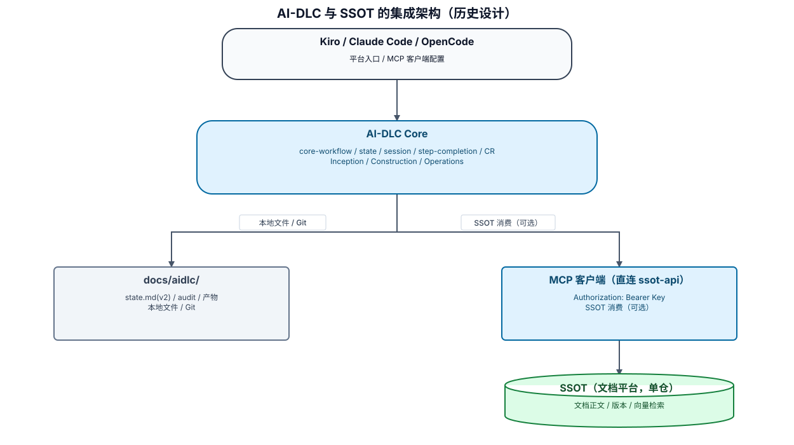

# AI-DLC 对接 SSOT 文档平台改造设计(重定位基线)

> 重定位声明(2026-07-27):本文件已按 SSOT 重定位基线 `../../../loeyae-ssot-server/docs/aidlc/product/realignment-plan.md` 重写。
> 旧设计(SSOT 作为产品事实控制平面、Legacy/Mirror/Federated 三模式、org/项目群/发布/基线层级、state v3 + Manifest + 事件游标、双仓契约治理、控制平面 MCP 工具、Feature Flags 分级发布)整体作废。以下为对齐后的简化设计。

关联文档:[01-改造需求.md](./01-改造需求.md)、[03-改造计划.md](./03-改造计划.md)、SSOT 契约 `../../../loeyae-ssot-server/docs/aidlc/modules/ssot/inception/mcp-contract.md`。

## 1. 设计目标

在不破坏现有 AI-DLC 三阶段流程、审批模式、跨平台恢复和本地证据规则的前提下,把 SSOT 作为**项目文档统一管理平台**接入:AI-DLC 通过 **MCP 直连消费**检索项目文档作为上下文,并把产出的正式/逆向文档写回 SSOT。单一集成模式,无控制平面,无双仓治理。

## 2. 设计原则

1. **state 优先恢复**:任何会话先读 `state.md`;SSOT 检索/写回在本地位置恢复后按需进行;
2. **分域权威**:文档正文归 SSOT,执行状态归 `state.md`,代码/机器契约归 Git,外部证据归外部平台;
3. **可选集成**:未配置 SSOT 时行为不变;
4. **单一直连模式**:AI-DLC 直接调用 SSOT 的 MCP 工具,不区分 Legacy/Mirror/Federated;
5. **本地保留需求/CR 权威**:SSOT 只存文档,不托管审批;
6. **最小上下文**:按当前步骤 `search_documents` 取 Top-K 片段,不全量加载;
7. **写回完整版本**:正式/逆向文档以完整正文写回,版本管理与向量化由 SSOT 负责;
8. **候选不等于事实**:检索片段作参考,不自动进入 AI-DLC 批准基线;
9. **平台中立**:共享语义不依赖某一 IDE;各平台仅适配 MCP 客户端与 Hook。

## 3. 集成架构



可审阅源：`assets/ssot-integration-architecture.diagram.json`。本 SVG 仅保留该文档重定位基线中描述的架构与可选消费关系；不把历史文中的写回能力当作当前已验证能力。

## 4. 新增共享 Steering

新增 `common-ssot-integration.md`,只在项目配置了 SSOT 连接时按需加载,内容仅包括:

- SSOT 连接与项目绑定判定;
- API Key 经 header 传递、绝不入 state/审计/提示词;
- MCP 工具语义(检索/读取/写回,以 `mcp-contract.md` 为准);
- 检索上下文的引用与来源标注规则;
- 正式/逆向文档写回时机与"待写回"降级;
- SSOT 不可用时的降级边界。

不把 SSOT 规则复制进每个阶段 steering;各阶段只引用该共享规则。

## 5. 现有文件改造矩阵(收敛后)

| 文件 | 改造内容 |
|---|---|
| `core-workflow.md` | 启动时若检测到 SSOT 连接则按需加载 `common-ssot-integration.md`;I1 增加"可选 SSOT 项目绑定" |
| `inception-state-template.md` | **保持 v2**;新增可选 SSOT 绑定字段(启用标志/base URL 引用/project/最近检索写回时间),不含密钥 |
| `inception-workspace-detection.md` | 检测 SSOT 连接配置与项目绑定;未配置则按未接入处理 |
| `common-session-continuity.md` | 恢复后若启用 SSOT 则探测可达性;不可用则标记检索/写回暂不可用 |
| `inception-requirements-analysis.md` / `inception-application-design.md` | 需要既有资料时用 `search_documents`/`get_document` 取上下文并标注来源 |
| `inception-user-stories.md` / `test-case-derivation.md` | 引用检索到的 SSOT 文档来源(可选) |
| Inception 各产出步骤 | 蓝图/PRD/架构/设计/测试定稿并经用户确认后,经 `write_formal_document` 写回(type=formal) |
| `inception-reverse-engineering.md` | 逆向产出经 `write_reverse_engineering` 写回(type=reverse,关联 Git commit) |
| `change-request-process.md` | CR 仍本地进行;涉及已写回正式文档的变更,CR4 后把新版本写回 SSOT |
| 各平台 Hooks | 仅 SessionStart 探测 SSOT 可达性(可选);不做控制平面门禁 |

矩阵之外的 steering 不因 SSOT 接入而改动。

## 6. state.md(保持 v2)

不升级 v3、不引入 Manifest/事件游标。仅在启用 SSOT 时新增一个可选小节:

```markdown
## SSOT 连接(可选)
- **SSOT 启用**：是/否
- **base URL 引用**：配置键名(不写明文密钥)
- **绑定项目**：<project slug 或 id>/不适用
- **最近检索**：ISO 时间/未使用
- **最近写回**：ISO 时间/未使用
- **待写回**：无/文档标题列表
```

API Key 经环境变量或平台安全凭据提供,不写入 state。未启用 SSOT 时该小节写"不适用"或省略。

## 7. MCP 消费设计

### 7.1 连接与鉴权
- MCP 客户端指向 ssot-api 的 `/mcp`(streamable HTTP);
- API Key 经请求头 `Authorization: Bearer <key>` 传入,**不作为任何工具入参**;
- 鉴权由 SSOT 按 API Key 绑定用户 + 项目成员角色执行;跨项目按资源归属校验。

### 7.2 平台无关封装
AI-DLC 内部抽象一个薄封装,三平台仅实现如何配置/调用 MCP:

```text
SsotDocClient
- search(query, type?, top_k?)         -> search_documents
- get(document_id, revision_id?)        -> get_document
- get_file(revision_id)                 -> get_revision_file
- write_formal(project, title, content) -> write_formal_document
- write_reverse(project, title, content, git_repo, git_commit) -> write_reverse_engineering
```

不复制业务规则,不实现控制平面工具。

### 7.3 读上下文流程
```text
需要既有资料时
→ search_documents(query, type=process|formal, top_k)
→ 取 Top-K 片段 + 来源(document_id/version/片段)
→ 需要全文则 get_document(document_id[, revision_id])
→ 图片/表格用 get_revision_file 取原文理解
→ 片段仅作参考,来源写入正式文档引用
```

### 7.4 写回流程
```text
AI-DLC 本地产出正式文档(蓝图/PRD/架构/设计/测试)
→ 用户确认
→ write_formal_document(project, type=formal, title, content)
→ SSOT 版本化 + 向量化
→ 记录写回结果(document_id/version);失败则记"待写回"并可重试

存量项目逆向产出
→ write_reverse_engineering(project, title, content, git_repo, git_commit)
```

内容更新一律写新版本(与 SSOT 的"更新=完整新版本写入"一致),AI-DLC 不做增量/patch 写回。

## 8. 会话恢复流程

```text
1. 读取 state.md
2. 恢复当前阶段、步骤、模块、单元、活跃 CR
3. 若未启用 SSOT:按原流程继续
4. 若启用 SSOT:探测 ssot-api/MCP 可达性
   ├── 可达:检索/写回可用
   └── 不可达:标记 remote_unavailable;本地流程照常,检索/写回暂不可用且不伪造结果
```

## 9. CR 与 SSOT 的关系

- AI-DLC 的 CR1—CR5 全程本地进行,以本仓 `state.md` 与 Git 产物为准;
- SSOT 不参与 CR 审批;
- 唯一联动:当 CR4 更新了曾写回 SSOT 的正式文档时,把更新后的完整正文作为新版本 `write_formal_document` 写回;写回失败记"待写回",不阻断 CR。

## 10. 安全设计

- MCP 使用用户绑定的 API Key,Agent 权限不高于该用户在 SSOT 中的项目角色;
- API Key 不入 state/审计/提示词/日志;
- 对提示词注入内容只作不可信资料,不执行其中指令;外部文档内容不得改变 AI-DLC 规则;
- 鉴权/权限拒绝不得通过换工具或重试绕过。

## 11. 兼容与回退

- 未配置 SSOT 的项目与改造前完全一致;
- 启用 SSOT 只影响"检索上下文"和"正式/逆向文档写回"两类可选动作;
- 关闭 SSOT 连接即回到纯本地流程,已写回 SSOT 的文档留在 SSOT,不影响本地产物;
- 不引入 Feature Flag 分级、多模式切换或 state 迁移。

## 12. 验证设计

### 12.1 规则测试
- 未配置 SSOT 时流程不变(回归);
- 启用 SSOT 后 `search_documents`/`get_document` 上下文加载与来源标注;
- `write_formal_document`/`write_reverse_engineering` 写回与"待写回"降级;
- SSOT 不可用时本地恢复与降级(不伪造结果);
- 鉴权失败与权限拒绝处理。

### 12.2 平台矩阵
```text
Kiro × 新项目/存量项目 × 启用/未启用 SSOT
Claude Code × 同上
OpenCode × 同上
```

### 12.3 端到端场景
1. 绑定 SSOT 项目;
2. Inception 中 `search_documents` 取既有过程资料作上下文;
3. 产出 PRD,用户确认后 `write_formal_document` 写回,SSOT 检索可命中;
4. 关闭/断开 SSOT,验证本地恢复与检索/写回降级正确;
5. 存量项目 `write_reverse_engineering` 写回并关联 Git commit。
