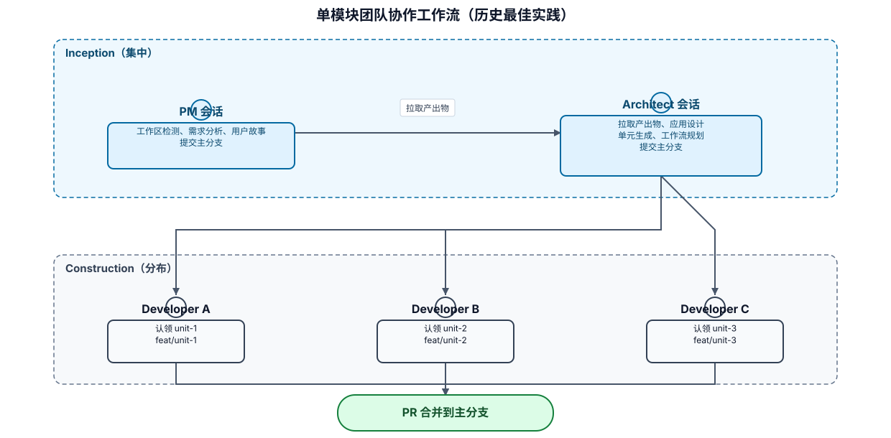
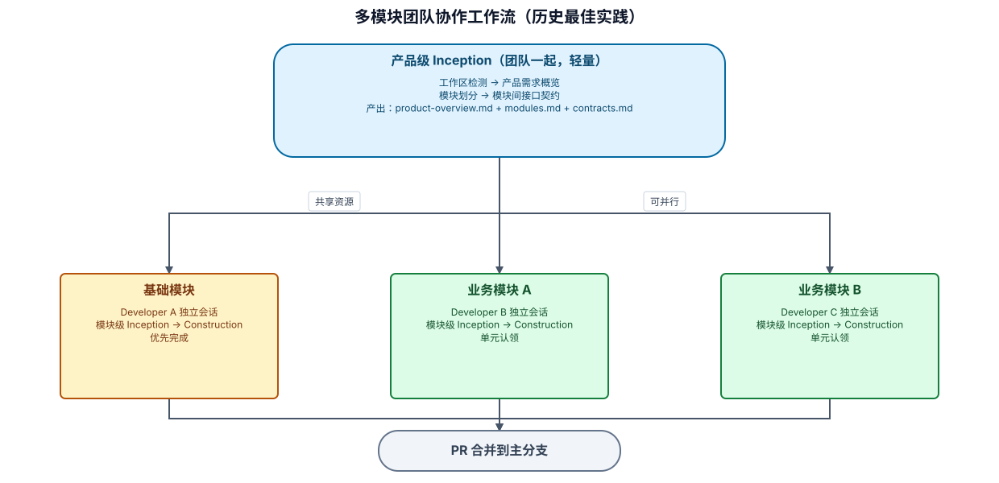

# Loeyae AI-DLC Power 使用最佳实践

## 一、激活提示词

### 关键词匹配场景

以下关键词会触发 Power 自动激活，无需显式输入"使用 AI-DLC"：

| 关键词 | 触发场景示例 |
|--------|-------------|
| `aidlc` / `AI-DLC` | "用 aidlc 开发一个用户模块"、"AI-DLC 流程怎么用" |
| `继续上次的工作` | "继续上次的工作，我昨天做到需求分析了" |
| `认领单元` | "我想认领单元 order-service" |
| `团队协作模式` | "团队协作模式，我是架构师" |
| `loeyae` | "loeyae 框架的 CRUD 怎么写" |
| `功能设计` | "开始 payment 单元的功能设计" |
| `用户故事` | "帮我写用户故事" |
| `架构设计` | "进入架构设计阶段" |
| `单元生成` | "执行单元生成" |
| `代码审查` | "对当前代码做代码审查" |
| `逆向工程` | "对现有代码做逆向工程分析" |
| `根因分析` | "这个 bug 需要根因分析" |

**注意**：如果你的消息中包含以上关键词但不想触发 AI-DLC 工作流，请明确说明意图，例如"不要启动 AI-DLC 流程，我只是问一个普通问题"。

### 基础激活格式

```
使用 AI-DLC，[描述你的开发需求]
```

### 按场景的提示词模板

#### 1. 全新项目启动（单模块）

```
使用 AI-DLC，我需要开发一个[项目描述]。
技术栈：后端 Spring Boot + Loeyae Boot Framework，前端 Vue 3 + Element Plus。
核心功能：[列出 3-5 个核心功能]。
团队协作模式，我是产品经理角色。
```

#### 2. 全新项目启动（多模块）

```
使用 AI-DLC，我需要开发一个[项目描述]。
技术栈：后端 Spring Boot + Loeyae Boot Framework，前端 Vue 3 + Element Plus。
核心业务域：
- [业务域1]：[一句话描述]
- [业务域2]：[一句话描述]
- [业务域3]：[一句话描述]
这是一个多模块项目，需要先做产品级规划。
团队协作模式，我是产品经理角色。
```

#### 3. 存量项目新功能

```
使用 AI-DLC，在现有项目中新增[功能描述]。
影响范围：[涉及的模块/页面]。
约束：[时间/技术/兼容性约束]。
```

#### 4. 团队协作 — 架构师接力

```
使用 AI-DLC，我是架构师，接手应用设计阶段。
请加载前序步骤的决策摘要，从应用设计开始。
```

#### 5. 团队协作 — 开发者认领单元

```
使用 AI-DLC，我是开发者，想认领一个单元开始开发。
```

#### 6. 多模块 — 进入指定模块

```
使用 AI-DLC，进入 [module-name] 模块，继续开发。
```

#### 7. 会话恢复（中断后继续）

```
使用 AI-DLC，继续上次的工作。
```

#### 8. 简单 Bug 修复（最小深度）

```
使用 AI-DLC，修复[具体问题描述]。
这是一个简单修复，请用最小深度执行。
```

---

## 二、架构模式选择

### 何时选择多模块模式

| 条件 | 单模块 | 多模块 |
|------|--------|--------|
| 业务域数量 | 1-2 个 | 3 个以上 |
| 团队规模 | 1-2 人 | 3 人以上可并行 |
| 模块间是否需要独立交付 | 否 | 是 |
| Inception 产出物是否超出单会话上下文 | 否 | 是 |
| 项目周期 | < 4 周 | > 4 周 |

### 自动判断

AI 会在工作区检测阶段根据需求规模自动建议架构模式：
- 如果只有 1 个业务模块 → 自动退化为单模块模式（体验与传统流程一致）
- 如果有多个业务模块 → 建议多模块模式，用户可确认或覆盖

### 两种模式的流程对比

```
单模块模式：
  Inception（完整） → Construction（单元认领）

多模块模式：
  产品级 Inception（轻量） → 模块级 Inception + Construction（可并行）
```

---

## 三、控制工作流深度的提示词技巧

### 明确指定深度

```
使用 AI-DLC，[需求描述]。请用全面深度执行需求分析。
```

```
使用 AI-DLC，[需求描述]。这是一个简单变更，请用最小深度快速推进。
```

### 跳过/包含特定阶段

```
使用 AI-DLC，[需求描述]。跳过用户故事阶段，直接进入应用设计。
```

```
使用 AI-DLC，[需求描述]。需要包含 NFR 需求评估，性能是关键考量。
```

### 指定单元开发顺序

```
使用 AI-DLC，继续 Construction 阶段。先开发 user-service 单元，因为其他单元依赖它的接口。
```

### 多模块模式下的深度控制

```
使用 AI-DLC，[需求描述]。产品级 Inception 用标准深度，模块级按需调整。
```

```
使用 AI-DLC，进入 data 模块。这个模块比较简单，请用最小深度快速推进 Inception。
```

---

## 四、多角色澄清最佳实践

### 机制说明

需求分析阶段内置了多角色轮次澄清机制，AI 会从不同角色视角逐轮提问，确保需求完整无歧义：

| 轮次 | 角色 | 关注点 | 执行条件 |
|------|------|--------|----------|
| 1 | 产品经理 | 业务价值、用户场景、优先级、验收标准 | 标准+全面深度 |
| 2 | 最终用户 | 使用体验、操作直觉性、痛点解决、学习成本 | 标准+全面深度 |
| 2a-c | 多用户角色 | 基于画像的各角色特定场景、习惯、障碍 | 仅全面深度 |
| 3 | 架构师 | 技术可行性、系统边界、集成点、性能约束 | 标准+全面深度 |
| 4 | 开发者 | 数据模型、接口定义、边界条件、错误处理 | 仅全面深度 |
| 5 | 测试人员 | 测试场景、边界用例、异常流程、验收标准可测试性 | 仅全面深度 |
| 6 | 全局一致性 | 跨角色矛盾、用户视角与实施视角冲突、遗漏 | 仅在发现矛盾时触发 |

**标准深度**执行 3 轮：产品 → 用户（统一最终用户角色）→ 架构

**全面深度**执行 5 轮+：产品 → 多用户角色（基于画像）→ 架构 → 开发 → 测试 + 条件触发全局一致性

### 如何配合多角色澄清

#### 1. 在初始提示中提供足够信息减少轮次

初始提示越完整，每轮需要澄清的问题越少：

```
使用 AI-DLC，开发订单管理模块。

【产品视角】
- 目标用户：运营人员
- 核心场景：创建订单、审核订单、退款处理
- 优先级：创建 > 审核 > 退款
- 验收标准：订单创建后 3 秒内可在列表中查询到

【用户视角】
- 运营人员每天处理 200+ 订单，操作效率是第一优先
- 批量操作是刚需（批量审核、批量导出）
- 常见痛点：频繁切换页面、重复填写信息
- 期望：关键操作有明确反馈，错误时能快速定位原因

【架构视角】
- 需对接支付网关（支付宝、微信）
- 预计日订单量 5000+
- 需要幂等性保证（防重复提交）

【开发视角】
- 订单状态：待支付→已支付→已发货→已完成/已退款
- 需要订单号生成规则（年月日+序号）

【测试视角】
- 并发下单场景需要压测
- 退款需要测试部分退款和全额退款
```

#### 2. 用户视角轮次的配合

用户视角关注的是"用起来怎么样"，而非"能不能做"。回答时从使用者角度思考：

```
AI（用户视角）: 用户在创建订单时，如果填写到一半需要离开，期望的行为是？
    A) 自动保存草稿，下次回来继续
    B) 弹窗提醒"未保存将丢失"，用户选择
    C) 不保存，用户需要重新填写

[回答]: A
原因：运营人员经常被打断（接电话、处理紧急事务），自动保存草稿能避免重复劳动，
符合他们的工作节奏。
```

**全面深度下的多用户角色**：AI 会基于用户画像为每个关键角色分别提问。不同角色可能对同一功能有不同优先级感知：

```
AI（角色：新手运营）: 新手运营首次使用订单系统时，最大的困惑可能是什么？
AI（角色：资深运营）: 资深运营每天处理 200+ 订单，最影响效率的操作是什么？
```

#### 3. 回答时附上决策理由

每轮回答时说明"为什么"，帮助后续角色轮次理解上下文：

```
[回答]: B（使用消息队列异步处理）
原因：订单创建后需要通知库存、物流、积分等多个下游系统，
同步调用会导致响应时间过长，且任一下游故障会阻塞主流程。
```

#### 4. 主动标注跨角色关联

如果你在某轮回答中意识到会影响其他角色的关注点，主动标注：

```
[回答]: A（支持批量导入订单）
注意：这会影响架构视角的性能设计（批量导入可能产生瞬时高并发），
也会影响测试视角（需要准备大批量测试数据），
同时用户视角需要考虑批量导入的进度反馈和错误提示。
```

#### 5. 控制澄清深度

如果你认为某些角色视角不需要，可以在初始提示中指定：

```
使用 AI-DLC，[需求描述]。
请用标准深度执行需求分析（产品+用户+架构视角澄清）。
```

或者在某轮澄清中提前结束：

```
这个角色视角的问题已经足够了，请进入下一轮。
```

#### 6. 全局一致性轮次的配合

当 AI 在全局一致性轮次提出跨角色矛盾时（包括用户视角与技术视角的冲突），需要你做出明确的取舍决策：

```
AI: 用户视角要求"实时推送订单状态变更"（用户期望立即看到变化），
    但架构视角确认当前基础设施不支持 WebSocket。
    A) 降级为轮询方案（每 5 秒查询一次）— 用户体验略有延迟
    B) 增加 WebSocket 基础设施投入 — 满足用户期望但增加成本
    C) MVP 阶段用轮询，后续迭代升级为 WebSocket — 渐进式满足

[回答]: C
原因：MVP 时间紧张，轮询方案可以快速实现。用户可以接受 5 秒延迟。
在 state.md 中记录为技术债务，第二期迭代时升级。
```

---

## 五、提高产出质量的提示词技巧

### 提供充分的上下文

**差的提示词**：
```
使用 AI-DLC，做一个用户管理系统。
```

**好的提示词**：
```
使用 AI-DLC，开发一个企业级用户管理系统。
- 目标用户：内部管理员（约 50 人）
- 核心功能：用户 CRUD、角色权限管理（RBAC）、操作审计日志
- 非功能要求：支持 1000 并发用户，API 响应 < 200ms
- 集成：对接现有 LDAP 进行身份认证
- 前端需要：用户列表页、用户详情页、角色配置页
- 约束：必须兼容现有数据库 schema（users 表已存在）
```

### 在回答问题时提供决策理由

当 AI 提出澄清问题时，不要只选选项，附上理由：

**差的回答**：
```
[回答]: A
```

**好的回答**：
```
[回答]: A
原因：我们选择微服务架构，因为团队有 5 人可以并行开发，且各模块的发布节奏不同。支付模块需要独立扩容。
```

这些理由会被记录到审计日志和决策摘要中，对后续接手的人非常有价值。

---

## 六、团队协作的提示词最佳实践

### 产品经理

```
使用 AI-DLC，团队协作模式，我是产品经理。
[需求描述]
验收标准：
1. [具体可测试的标准]
2. [具体可测试的标准]
优先级：[功能A] > [功能B] > [功能C]
```

**要点**：
- 提供明确的验收标准（AI 会用它生成质量门禁检查项）
- 给出优先级排序（影响单元开发顺序）
- 说明"不做什么"和"为什么不做"（避免后续阶段的过度设计）

### 架构师

```
使用 AI-DLC，团队协作模式，我是架构师，接手应用设计。
技术约束：
- 必须使用 [框架/中间件]
- 部署环境：[K8s/ECS/...]
- 现有系统集成点：[列出]
架构偏好：[单体/微服务/模块化单体]，原因：[理由]
```

**要点**：
- 明确技术约束（避免 AI 在设计时做出不可行的选择）
- 说明架构偏好和理由（AI 会据此决定单元拆分方式）
- 指出已知的技术风险点

### 开发者

```
使用 AI-DLC，团队协作模式，我是开发者，认领 [unit-name] 单元。
我的技术背景：熟悉 [技术栈]。
开发分支：feat/[unit-name]
```

**要点**：
- 说明技术背景（AI 会调整代码注释的详细程度）
- 指定分支名（AI 会在完成消息中引用）

---

## 七、Token 效率最佳实践

### 恢复会话时

```
使用 AI-DLC，继续上次的工作。只加载当前单元的上下文即可。
```

如果需要查看其他单元的信息：
```
请加载 payment-service 单元的接口定义，我需要确认调用方式。
```

### 大项目中途

```
使用 AI-DLC，继续 unit-3 的代码生成。
当前进度：代码生成计划第 4 步。
不需要加载前面单元的内容。
```

### 多模块项目中途

```
使用 AI-DLC，继续 data 模块的 Construction。
不需要加载其他模块的产出物，只需 contracts.md 和本模块内容。
```

切换模块时：
```
切换到 security 模块。不需要保留当前模块的上下文。
```

### 明确告知不需要的内容

```
使用 AI-DLC，继续开发。不需要重新展示欢迎消息和流程概览。
```

---

## 八、多模块模式最佳实践

### 8.1 产品级 Inception 的配合技巧

产品级 Inception 是多模块模式的第一步，目标是确定"有哪些模块"和"模块间怎么交互"，不深入模块内部细节。

#### 提供清晰的业务域划分线索

**好的提示词**：
```
使用 AI-DLC，开发一个企业级 SaaS 平台。

核心业务域：
- 用户管理：注册、登录、组织架构、角色权限
- 订单管理：下单、支付、退款、物流跟踪
- 商品管理：商品发布、分类管理、库存管理
- 数据分析：报表、看板、导出

模块间关系：
- 订单依赖用户（下单人）和商品（商品信息）
- 数据分析依赖所有模块的数据

这是一个多模块项目，团队 5 人可并行开发。
```

**差的提示词**：
```
使用 AI-DLC，做一个 SaaS 平台，功能很多。
```

#### 模块划分的决策要点

当 AI 提出模块划分方案时，关注以下几点：
- 每个模块是否能独立交付价值？
- 模块间依赖是否尽量单向？
- 基础模块是否承载了所有共享资源？
- 模块粒度是否适中（太细增加契约复杂度，太粗失去并行优势）？

#### 接口契约的审查要点

contracts.md 是模块间协作的"合同"，审查时关注：
- 接口定义是否到方法签名级别（足够模块独立开发）
- 是否覆盖了所有跨模块交互场景
- 事件定义是否明确了 payload 结构
- 是否有循环依赖

### 8.2 模块级开发的提示词

#### 进入模块

```
使用 AI-DLC，进入 user-management 模块，开始模块级 Inception。
```

#### 模块内认领单元

```
使用 AI-DLC，我在 order-management 模块中，认领 order-service 单元。
```

#### 引用接口契约

```
使用 AI-DLC，继续 payment 模块开发。
请参考 contracts.md 中 order→payment 的接口定义。
```

#### 模块间切换

```
切换到 security 模块，继续上次的 Construction。
```

### 8.3 并行开发协作

#### 团队分工示例

```
产品级 Inception（PM + Architect 一起，1-2 次会话）
    │
    │  确定模块划分和接口契约
    │
    ├── 开发者 A：base-infrastructure（独立会话，优先完成）
    ├── 开发者 B：user-management（独立会话）
    ├── 开发者 C：order-management（独立会话）
    └── 开发者 D：payment（等 base 接口定义完成后开始）
```

#### 并行开发的规则

1. **基础模块优先**：基础模块的 Inception 必须先完成（接口契约是其他模块的前置）
2. **基础模块 Construction 可并行**：基础模块的代码实现可以和业务模块的 Inception 同时进行
3. **业务模块间无依赖**：业务模块通过 contracts.md 定义的接口交互，开发时可 mock
4. **一个模块一人负责**：避免多人同时修改同一模块的产出物

#### 依赖模块未完成时的处理

```
使用 AI-DLC，继续 payment 模块开发。
base 模块的代码尚未完成，请在代码中 mock 相关接口，
后续集成测试阶段再验证真实调用。
```

### 8.4 接口契约变更管理

#### 发起变更

当你在某个模块开发中发现需要修改接口契约：

```
使用 AI-DLC，我在 base 模块开发中发现需要给 SecurityUtil 新增方法 getLoginUserOrgId()。
请更新 contracts.md 并记录变更日志。
```

#### 响应变更通知

当 AI 在恢复会话时提示有契约变更：

```
AI: ⚠️ 检测到接口契约变更：SecurityUtil 新增 getLoginUserOrgId()

[回答]: A（立即处理）
原因：数据权限模块正好需要组织 ID 来做部门级数据隔离，这个接口正是我需要的。
```

#### 变更通知的最佳实践

- 变更方在 contracts.md 的变更日志中记录：时间、变更内容、影响模块
- 被影响模块的开发者在下次恢复时会自动收到通知
- 不阻塞当前工作，可以选择"稍后处理"

### 8.5 渐进式模块划分

不需要一次性规划完所有模块，支持后续新增：

```
使用 AI-DLC，在现有多模块项目中新增一个 notification 模块。
职责：站内信、短信、邮件通知的统一管理。
依赖：user-management（获取用户联系方式）。
```

AI 会：
1. 更新 modules.md（追加新模块）
2. 更新 contracts.md（定义新模块与现有模块的接口）
3. 更新 state.md（新模块初始状态为"未开始"）

### 8.6 多模块模式的目录结构

```
docs/aidlc/
├── product/                          # 产品级产出物
│   ├── product-overview.md           # 产品需求概览
│   ├── modules.md                    # 模块划分
│   ├── contracts.md                  # 模块间接口契约
│   └── decision-summary.md           # 产品级决策摘要
│
├── modules/                          # 各模块独立目录
│   ├── base-infrastructure/
│   │   ├── inception/                # 模块级 Inception 产出物
│   │   └── construction/             # 模块级 Construction 产出物
│   ├── user-management/
│   │   ├── inception/
│   │   └── construction/
│   └── order-management/
│       ├── inception/
│       └── construction/
│
└── state.md                          # 全局状态（含模块进度总览）
```

**关键点**：
- 产品级产出物极轻量（~5-10KB），只定义模块边界和接口
- 各模块物理隔离，互不干扰
- 单模块项目自动退化为传统目录结构（无 `product/` 和 `modules/`）

---

## 九、Construction 阶段流程最佳实践

AI-DLC 的 Construction 阶段集成了多项质量保障机制。了解这些机制有助于更好地配合 AI 工作。

### 9.1 强制 TDD（测试驱动开发）

Construction 阶段强制执行 RED-GREEN-REFACTOR 循环：

```
RED   → 先写一个失败测试（描述期望行为）
GREEN → 写最少代码让测试通过
REFACTOR → 清理代码，保持测试绿色
```

#### 用户需要配合的要点

1. **不要催促跳过测试**：TDD 比"先写代码后补测试"更快发现 bug
2. **理解快速模式**：如果时间紧张，可以要求"快速模式 TDD"——允许先写代码后立即补测试，但测试仍然是强制的
3. **测试不可拖延**：每个功能的测试必须在同一交互中完成，不可说"测试下次补"

#### 快速模式的提示词

```
使用 AI-DLC，继续 Construction。请用快速模式推进（Code-First + Immediate Test）。
```

#### Bug 修复时的 TDD

```
使用 AI-DLC，修复 [bug 描述]。
请先写一个重现 bug 的失败测试，再修复。
```

### 9.2 两阶段代码审查

每个单元完成后，AI 会执行两阶段审查：

```
阶段 1：规格合规审查 — 实现是否匹配规格？多了什么？少了什么？
    ↓ 通过后
阶段 2：代码质量审查 — 代码质量、命名、结构、安全性
```

#### 用户需要配合的要点

1. **审查结果需要你确认**：AI 会展示审查发现的问题，你需要确认是否修复
2. **关键问题必须修复**：逻辑错误、安全漏洞、数据风险不可跳过
3. **建议类问题可选**：性能优化、更好的抽象等可以根据时间决定

#### 不同意审查意见时

```
这个审查意见我不同意，原因是 [技术理由]。请跳过这个问题继续。
```

#### 请求额外审查

```
请对当前代码做一次额外的代码质量审查，我担心 [具体方面]。
```

### 9.3 系统化调试

当遇到技术问题时（测试失败、构建错误、意外行为），AI 会执行四阶段调试流程：

```
第一阶段：根因调查 — 读错误、重现、检查变更、追踪数据流
第二阶段：模式分析 — 找工作示例、对比差异
第三阶段：假设与测试 — 形成假设、最小测试验证
第四阶段：实施 — 创建失败测试、修复、验证
```

#### 关键规则：3+ 次修复失败 = 质疑架构

如果同一个问题修复了 3 次以上仍未解决，AI 会停下来质疑架构设计，而不是继续尝试修补。这时需要你参与决策：

```
AI: 已尝试 3 次修复，每次都揭示新问题。这可能是架构层面的问题。
    A) 重构这部分架构
    B) 换一种实现方式
    C) 降低需求复杂度

[回答]: [你的选择 + 理由]
```

#### 用户需要配合的要点

1. **不要催促"快速修一下"**：系统化调试比随机尝试更快
2. **提供重现信息**：如果你发现了 bug，尽量提供重现步骤
3. **配合架构决策**：当 AI 质疑架构时，认真考虑是否需要调整设计

### 9.4 平台自适应子 Agent 执行

AI-DLC 会根据平台能力自动选择执行模式：

| 模式 | 条件 | 特点 |
|------|------|------|
| 子 Agent 模式 | 平台支持子 Agent 派发 | 独立上下文、新鲜视角审查 |
| 单 Agent 两阶段审查模式 | 平台不支持子 Agent | 主 Agent 切换视角自审 |

#### 用户需要了解的

- **子 Agent 模式下**：AI 会连续执行计划中的所有任务，不会在任务之间暂停询问。如果需要中断，主动说"暂停"
- **单 Agent 模式下**：AI 会在完成实现后切换到"审查员视角"重新检查代码
- **两种模式的质量保障一致**：都执行 TDD + 两阶段审查

#### 控制执行节奏

```
使用 AI-DLC，继续 Construction。连续执行所有任务，完成后再汇报。
```

```
使用 AI-DLC，继续 Construction。每完成一个单元暂停一下让我确认。
```

### 9.5 说服式防护与验证纪律

AI-DLC 内置了"说服式防护"机制——AI 不会因为时间压力或"看起来简单"就跳过步骤。

#### 这意味着什么

- AI 不会说"应该没问题"——每个完成声明都需要证据（测试通过、构建成功等）
- AI 不会跳过审查——即使改动很小
- AI 不会在没有根因分析的情况下修复 bug

#### 如果你确实需要跳步

AI 会尊重你的明确决策，但会告知风险：

```
我知道跳过测试有风险，但时间紧迫，请跳过 TDD 直接实现。
```

AI 会：
1. 告知跳步的具体风险
2. 记录到审计日志
3. 按你的要求执行

### 9.6 Session 交接

每个阶段/步骤完成时，AI 会生成一个可复制的"新 Session 提示词"，同时写入 `state.md` 顶部的"下一步交接"字段。

#### 为什么需要 Session 交接

- 长会话的 token 消耗越来越大，响应质量可能下降
- 新 session 有新鲜的上下文窗口，AI 表现更好
- 团队协作时，不同人可以用提示词在自己的会话中继续

#### 何时使用新 Session

建议在以下节点开启新 session：
- Inception 完成，准备进入 Construction
- 一个单元完成，准备开始下一个
- 产品级 Inception 完成，准备进入模块开发
- 会话已经很长（感觉 AI 响应变慢或质量下降）

#### 获取交接提示词的方式

**方式 1：从聊天中复制**

AI 完成一个阶段后，完成消息中会包含 `📋 新 Session 继续` 选项。

**方式 2：从 state.md 中获取（推荐，尤其适合团队协作）**

打开 `docs/aidlc/state.md`，顶部的"下一步交接"表格始终包含最新的交接提示词：

```markdown
## 下一步交接

| 范围 | 更新时间 | 提示词 |
|------|----------|--------|
| 产品级 | 2025-01-15 | `使用 AI-DLC，继续模块开发。产品级 Inception 已完成，请读取 state.md 展示模块选择菜单。` |
| order 模块 | 2025-01-16 | `使用 AI-DLC，继续 order 模块的 Construction。已完成：order-service 单元，下一步：order-query 单元。请读取 state.md 恢复上下文。` |
```

**团队协作场景**：接手人无需依赖上一人的聊天记录，拉取最新代码后直接查看 `state.md` 即可获取交接提示词。各人/模块各自维护自己的行，Git 合并冲突概率极低。

---

## 十、常见场景的完整提示词示例

### 场景 1：从零开始一个中型项目（单模块）

```
使用 AI-DLC，开发一个在线课程管理平台。

团队协作模式，我是产品经理。

目标用户：
- 教师：创建和管理课程内容
- 学生：浏览、购买和学习课程
- 管理员：平台运营和数据统计

核心功能：
1. 课程 CRUD（含视频上传、章节管理）
2. 用户注册登录（手机号 + 邮箱）
3. 课程购买和支付（支付宝 + 微信）
4. 学习进度跟踪
5. 后台数据看板

技术栈：后端 Spring Boot + Loeyae Boot，前端 Vue 3 + Element Plus。
部署：阿里云 ECS，MySQL + Redis。

时间约束：MVP 版本 4 周内完成。
优先级：功能 1 > 2 > 3 > 4 > 5
```

### 场景 2：从零开始一个大型项目（多模块）

```
使用 AI-DLC，开发一个企业级电商平台。

团队协作模式，我是产品经理。多模块模式。

目标用户：
- 买家：浏览、下单、支付、售后
- 卖家：商品管理、订单处理、数据分析
- 运营：活动管理、内容管理、客服

核心业务域：
- 用户中心：注册登录、个人信息、收货地址、会员体系
- 商品中心：商品发布、分类、SKU、库存
- 订单中心：下单、支付、退款、物流
- 营销中心：优惠券、满减活动、秒杀
- 数据中心：报表、看板、用户行为分析

技术栈：后端 Spring Boot + Loeyae Boot，前端 Vue 3 + Element Plus。
部署：K8s，MySQL + Redis + Kafka。

团队：5 名开发者可并行。
时间约束：第一期 8 周，先完成用户 + 商品 + 订单。
```

### 场景 3：存量项目加功能

```
使用 AI-DLC，在现有电商系统中新增"优惠券"功能。

单人模式。

功能描述：
- 管理员可创建优惠券（满减、折扣、固定金额）
- 用户可领取和使用优惠券
- 下单时自动推荐最优优惠券
- 优惠券有有效期和使用次数限制

影响范围：
- 后端：新增 coupon 模块，修改 order 模块的价格计算
- 前端：新增优惠券管理页、用户优惠券列表、下单页优惠券选择

约束：
- 不能影响现有下单流程的性能（< 500ms）
- 需要防止优惠券超发（并发安全）
```

### 场景 4：多模块项目中认领模块

```
使用 AI-DLC，团队协作模式，我是开发者张三。

进入 order-management 模块，开始模块级 Inception。
分支：feat/order-management

产品级规划已完成，请参考 contracts.md 中的接口定义。
我负责这个模块从 Inception 到 Construction 的完整流程。
```

### 场景 5：开发者认领单元（模块内）

```
使用 AI-DLC，团队协作模式，我是开发者张三。

认领 payment-service 单元。
分支：feat/payment-service

请展示该单元的：
- 需要实现的用户故事
- 依赖的接口（来自其他单元）
- 建议的开发顺序
```

---

## 十一、避免的反模式

| 反模式 | 问题 | 正确做法 |
|--------|------|----------|
| 一次性倾倒所有需求 | AI 可能遗漏细节 | 先给核心需求，在需求分析阶段逐步补充 |
| 跳过审批直接说"继续" | 失去质量把控机会 | 花 30 秒审查产出物再批准 |
| 在聊天中修改需求而不更新文档 | 文档与实际不一致 | 要求 AI 同步更新需求文档 |
| 多人同时修改同一个单元 | Git 冲突 | 一个单元只能一人认领 |
| 恢复时要求"加载所有内容" | Token 浪费 | 信任延迟加载，需要时再要求加载 |
| 不提供决策理由 | 后续接手人不理解背景 | 回答问题时附上理由 |
| 多模块项目不做产品级规划 | 模块间接口冲突 | 先完成产品级 Inception，定义清晰的接口契约 |
| 跳过基础模块直接开发业务模块 | 缺少公共接口定义 | 基础模块 Inception 必须先完成 |
| 在模块内加载其他模块的产出物 | 上下文膨胀 | 只通过 contracts.md 了解其他模块的接口 |
| 口头约定模块间接口不更新 contracts.md | 接口不一致 | 任何接口变更必须同步更新 contracts.md |
| 催促"先写代码后补测试" | 后补测试证明不了正确性 | 让 AI 按 TDD 流程执行，或用快速模式 |
| 跳过代码审查说"我看过了没问题" | 盲点不被发现 | 让 AI 完成两阶段审查再继续 |
| Bug 修复时直接改代码不写测试 | 无法防止回归 | 先写重现 bug 的测试，再修复 |
| 同一问题反复尝试修复不停下来 | 可能是架构问题 | 3 次失败后质疑架构，与 AI 讨论替代方案 |
| 单个 session 用到底不换 | Token 耗尽，质量下降 | 在阶段节点使用 Session 交接提示词开新会话 |

---

## 十二、提示词速查表

| 意图 | 提示词 |
|------|--------|
| 启动新项目 | `使用 AI-DLC，[需求]` |
| 指定多模块模式 | `多模块模式` 或 `这是一个多模块项目` |
| 指定协作模式 | `团队协作模式，我是[角色]` |
| 指定深度 | `请用[最小/标准/全面]深度` |
| 跳过阶段 | `跳过[阶段名]` |
| 恢复工作 | `使用 AI-DLC，继续上次的工作` |
| 进入模块 | `进入 [module-name] 模块` |
| 切换模块 | `切换到 [module-name] 模块` |
| 认领模块 | `进入 [module-name] 模块，开始模块级 Inception` |
| 认领单元 | `认领 [unit-name] 单元` |
| 接力接手 | `我是[角色]，接手[步骤名]` |
| 查看进度 | `展示当前项目状态` |
| 新增模块 | `新增一个 [module-name] 模块` |
| 修改契约 | `更新 contracts.md，[变更描述]` |
| 快速模式 TDD | `请用快速模式推进（Code-First + Immediate Test）` |
| 请求额外审查 | `请对当前代码做一次额外的代码质量审查` |
| 跳过 TDD（需说明理由） | `跳过 TDD 直接实现，原因：[理由]` |
| 暂停连续执行 | `暂停` 或 `每完成一个单元暂停让我确认` |
| 连续执行 | `连续执行所有任务，完成后再汇报` |
| 新 Session 继续 | 复制 AI 生成的 Session 交接提示词到新对话 |
| 请求修改 | `请修改[具体内容]` |
| 按需加载 | `请加载 [文件/单元/模块] 的 [具体内容]` |

---

## 十三、团队协作工作流速览

### 单模块模式



可审阅源：`assets/historical-diagrams.diagram.json`。图中保留集中 Inception 接力和按单元分布式 Construction 的历史说明。

### 多模块模式



可审阅源：`assets/historical-diagrams.diagram.json`。图中保留产品级轻量 Inception、基础模块优先以及业务模块并行推进的历史说明。

**关键区别**：
- 单模块模式：并行只发生在 Construction 阶段（单元级）
- 多模块模式：并行从 Inception 阶段就开始（模块级），每个模块独立走完整流程

---

## 十四、FAQ

### Q: 单人模式和团队协作模式有什么区别？
A: 单人模式下所有阶段在一个连续会话中完成，不需要填写负责人、不生成决策摘要、不执行文档切片。团队协作模式增加了角色分工、接力交接、单元认领和文档切片机制。

### Q: 什么时候应该选择团队协作模式？
A: 当项目满足以下任一条件时建议使用团队协作模式：
- 有 2 人以上参与开发
- 项目有 3 个以上单元
- 需求和设计由不同角色负责
- 项目周期超过 2 周

### Q: 单模块模式和多模块模式有什么区别？
A: 单模块模式是传统流程，整个产品走一次 Inception + Construction。多模块模式先做轻量的产品级 Inception（确定模块划分和接口契约），然后每个模块独立走完整的 Inception + Construction，支持并行开发。

### Q: 什么时候应该选择多模块模式？
A: 当项目满足以下条件时建议使用多模块模式：
- 有 3 个以上独立的业务域
- 团队有 3 人以上可并行开发
- 单次 Inception 的产出物量太大（超出单会话上下文）
- 各模块可以独立交付价值

### Q: 多模块模式下，模块间怎么协作？
A: 通过 contracts.md（模块间接口契约）协作。每个模块只需要知道其他模块暴露的接口，不需要了解其他模块的内部实现。开发时可以 mock 依赖模块的接口，集成测试阶段再验证真实调用。

### Q: 产品级 Inception 需要多长时间？
A: 通常 1-2 次会话即可完成。产品级 Inception 只确定"有哪些模块"和"模块间怎么交互"，不深入模块内部细节，产出物极轻量（~5-10KB）。

### Q: 基础模块必须完全开发完才能开始业务模块吗？
A: 不需要。基础模块的 Inception 必须先完成（接口契约是业务模块的前置），但基础模块的 Construction（代码实现）可以和业务模块的 Inception/Construction 并行。业务模块开发时可以 mock 基础模块的接口。

### Q: 可以中途新增模块吗？
A: 可以。modules.md 支持追加新模块，新增时需要同步更新 contracts.md（定义与现有模块的接口）。新模块在 state.md 中初始状态为"未开始"。

### Q: 接口契约变更了怎么办？
A: 变更方在 contracts.md 的变更日志中记录变更内容和影响模块。被影响模块的开发者在下次恢复会话时，AI 会自动检测并提示变更，开发者可以选择立即处理或稍后处理。

### Q: 认领冲突怎么办？
A: Git 先到先得。谁先把认领信息推送到主分支，谁就拿到该单元/模块。后推送的人拉取后发现已被认领，重新选择即可。

### Q: 可以中途从单人模式切换到团队协作模式吗？
A: 可以，但建议在 Inception 完成后再切换。在 state.md 中将"协作模式"改为"团队协作"，然后执行文档切片即可。

### Q: 可以从单模块模式切换到多模块模式吗？
A: 可以，但建议在项目早期切换。需要补做产品级 Inception（模块划分 + 接口契约），然后将现有产出物迁移到对应模块目录下。

### Q: 文档切片后发现某个需求分错了单元怎么办？
A: 原始完整文件保留为 `*.full.md` 归档。可以手动调整切片文件，或要求 AI 重新执行切片。

### Q: 如何查看其他单元/模块的进度？
A: 拉取最新主分支后查看 `state.md` 中的"模块进度总览"表，或直接问 AI：`展示当前项目状态`。

### Q: MCP Skill 服务不可用时怎么办？
A: `loeyae-skills` MCP 服务仅在 Java + Loeyae Boot Framework 项目的 Construction 阶段使用。如果服务暂时不可用，AI 会退回到 steering 文件中的通用编码规范继续工作，不会阻塞开发流程。

### Q: 如何确认 Power 安装正确？
A: 在 Kiro 聊天中输入 `使用 AI-DLC，展示欢迎消息`。如果 Power 正常工作，AI 会加载 `core-workflow.md` 并展示欢迎消息和可用选项。如果没有响应或报错，检查 Kiro Powers 面板中 Power 的安装状态。
