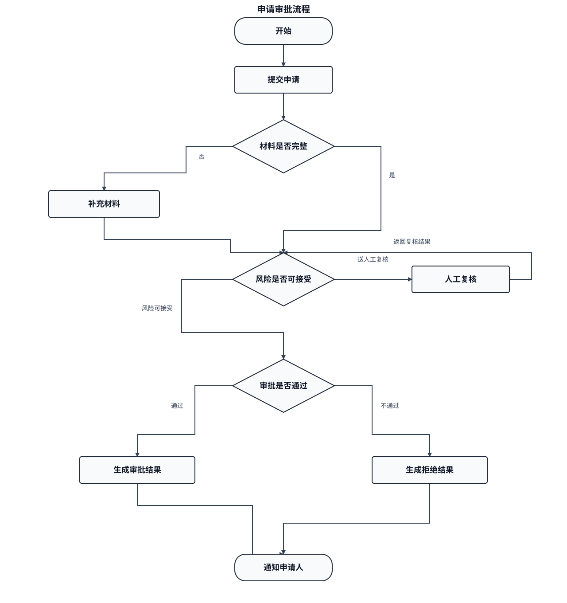

# 交付型业务流程图测试：10 节点 3 分支（SVG 严格端点 POC）

> 目的：验证 `delivery-business-flow` 在 SVG 源模式下能够以声明的扩展 profile 精确控制节点端点和正交路径，并由源码仓可选回归工具检查结构；目标环境的静态 SVG、预览或导出由外部 Provider 负责，不改变既有业务关系。
> 日期：2026-08-22

## SVG 流程图



## POC 产物与执行方式

| 产物 | 路径 | 职责 |
|---|---|---|
| 结构化源 | `assets/delivery-business-flow-test-10-nodes-3-branches.diagram.json` | 节点、端口、坐标、正交路径和标签的唯一可审阅来源；声明 `delivery-business-flow-strict@1.0.0` profile |
| SVG 目标快照 | `assets/delivery-business-flow-test-10-nodes-3-branches.svg` | 源码仓可选回归输出；不代表外部 Provider 或目标环境已验证 |
| 源码仓回归器 | `../scripts/render-delivery-business-flow-svg.mjs` | 按 profile 检查源并生成回归快照，不提供目标环境 preview/render/export |

扩展 profile 与通用契约的映射：

| 扩展字段 | 通用语义映射 |
|---|---|
| `nodes[].kind` | `shape`：`terminal` → `round`，`step` → `rect`，`decision` → `diamond` |
| `nodes[].mainInputPort` | 判断节点的主流程入顶点；对应所有进入该判断节点的 `edges[].toPort` |
| `edges[].kind` | 本 profile 仅允许 `directed`；流程不使用 `bidirectional` |
| `edges[].label.lines` | 通用 `edges[].label.text` 的非空字符串数组 |

重新生成并执行源码仓结构回归：

```bash
npm run render:delivery-business-flow-svg
```

该命令只维护源码仓回归快照，不代替目标 Provider。该 POC 不将已知无法满足端点规则的 Mermaid 代码块保留为正式图例。

## 流程语义

以下业务关系与原测试图保持一致：

1. **N01 开始** → **N02 提交申请**。
2. **N03 材料是否完整**：
   - 是 → **N05 风险是否可接受**；
   - 否 → **N04 补充材料** → **N05 风险是否可接受**。
3. **N05 风险是否可接受**：
   - 风险可接受 → **N07 审批是否通过**；
   - 需要人工复核 → **N06 人工复核**；**N06 人工复核** → **N05 风险是否可接受**，返回复核结果后再进入 N07。
4. **N07 审批是否通过**：
   - 通过 → **N08 生成审批结果**；
   - 不通过 → **N09 生成拒绝结果**。
5. **N08 生成审批结果** 或 **N09 生成拒绝结果** → **N10 通知申请人**。

## 节点清单

| 节点 ID | 节点名称 | 节点类型 |
|---|---|---|
| N01 | 开始 | 开始 |
| N02 | 提交申请 | 步骤 |
| N03 | 材料是否完整 | 判断 1 |
| N04 | 补充材料 | 步骤 |
| N05 | 风险是否可接受 | 判断 2 |
| N06 | 人工复核 | 步骤（两条有向交互） |
| N07 | 审批是否通过 | 判断 3 |
| N08 | 生成审批结果 | 步骤 |
| N09 | 生成拒绝结果 | 步骤 |
| N10 | 通知申请人 | 结束 |

## 分支与端点映射

| 关系 | SVG 端点 | 验收意图 |
|---|---|---|
| N02 → N03 | `N02.bottom → N03.top` | 判断主流程从顶部顶点进入 |
| N03 → N04 | `N03.left → N04.top` | 从 N03 顶部入点的左侧相邻顶点出 |
| N03 → N05 | `N03.right → N05.top` | 从 N03 顶部入点的右侧相邻顶点出；进入 N05 顶部顶点 |
| N04 → N05 | `N04.bottom → N05.top` | 与 N03 → N05 共用 N05 顶部顶点 `(640,570)` |
| N05 → N06 | `N05.right → N06.left` | 以单向边发送人工复核请求 |
| N06 → N05 | `N06.right → N05.top` | 以外侧正交有向边返回复核结果；不使用双向线 |
| N05 → N07 | `N05.left → N07.top` | 从 N05 顶部入点的左侧相邻顶点出 |
| N07 → N08 / N09 | `N07.left/right → N08/N09.top` | 从 N07 顶部入点的两个相邻顶点出 |
| N08 → N10 | `N08.bottom → N10.top` | 与 N09 → N10 共用 N10 顶边中点 `(640,1250)` |
| N09 → N10 | `N09.bottom → N10.top` | 与 N08 → N10 共用 N10 顶边中点 `(640,1250)` |

## 验证记录

- 输出形式：SVG 源 + `delivery-business-flow-strict@1.0.0` 语义 profile + 可选源码仓回归 SVG 快照；目标 Provider 产物未在本 POC 中宣称交付。
- 节点数量：10（N01–N10）。
- 判断分支数量：3（N03、N05、N07），每个判断恰好两条出线。
- 连线数量：12；N05 → N06 与 N06 → N05 是两条带语义标签的有向路径，不使用 `bidirectional`。
- Profile 映射验证：通过。`kind`、`mainInputPort` 和 `label.lines` 的私有字段映射、版本和回归器已记录在源 `profile` 与本说明中。
- 端点结构验证：通过。源码仓回归器校验每条路径从声明的 `fromPort` 出发并进入声明的 `toPort`，同时校验菱形主流程入顶点、相邻分支顶点、普通框共享边中点、正交路径、非零长度路径重叠、非端点节点穿越和标签覆盖。
- N05 双入线：通过。`N03 → N05` 与 `N04 → N05` 都以 `(640,570)` 作为终点。
- N10 双入线：通过。`N08 → N10` 与 `N09 → N10` 都以 `(640,1250)` 作为终点。
- 源码仓回归快照视觉检查：通过。使用本机 `rsvg-convert` 检查回归 SVG，连线为直线/正交折线，未见交叉、节点穿越、标签覆盖或非零长度重叠；该证据不代表 Kiro、Claude Code、OpenCode 或其他目标 Provider 已验证。
- Kiro Markdown SVG Preview：未单独执行。Chrome DevTools MCP 因已有浏览器会话冲突无法启动；该限制不影响已完成的 SVG 结构和本机栅格化视觉检查。
- draw.io Provider 导出：未验证。本机未检测到 draw.io CLI，且本次 Homebrew 安装未完成；本 POC 证明的是 provider 无关的确定性 SVG 模式，不能据此宣称 `.drawio → SVG` 导出已通过。

## 结论与边界

SVG 源模式对当前严格端点格式**可行**：profile 通过映射把私有输入字段约束到通用 SVG 语义，源码仓可选回归器检查端点和有向流程路径，而不是让 Mermaid 自动布局猜测。该回归器不是通用自动布局器，也不是目标环境 Provider。后续接入外部 Provider 时，仍需对同一端点测试案例执行独立目标导出与视觉验证。
