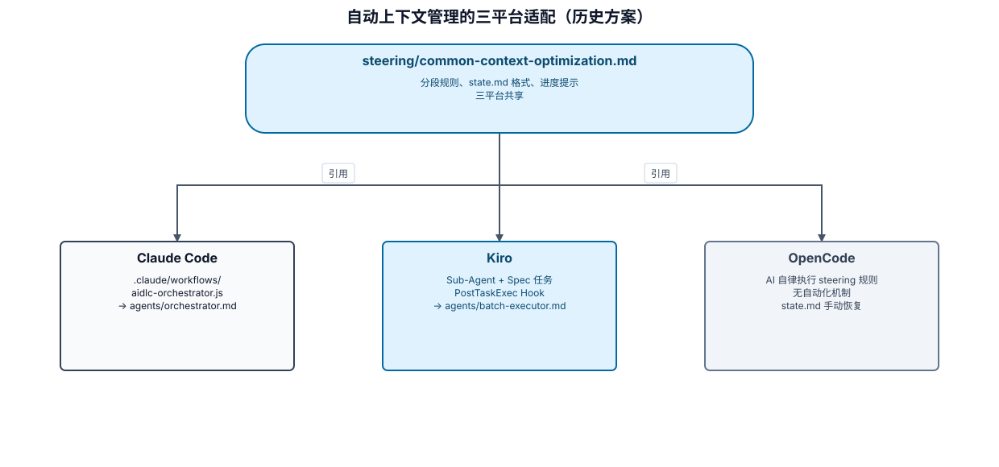

# AI-DLC 自动上下文管理方案

> 版本：3.0
> 日期：2026-07-03
> 变更：从 Claude Code 专用方案重构为三平台统一方案

## 方案概述

本方案解决 AI-DLC 长任务执行中的上下文溢出问题。采用「规则共享 + 平台适配」架构：

- **规则层**（`steering/common-context-optimization.md`）：定义分段策略、state.md 格式、进度提示 — 三平台共享
- **指令层**（`agents/`）：定义子 Agent 行为 — 平台无关
- **适配层**：各平台用自身机制调用指令层

---

## 方案架构



可审阅源：`assets/auto-context-management.diagram.json`。该图仅迁移本文件记录的 2026-07-03 方案语义，不表示其中的历史平台能力均已在当前运行时重新验证。

---

## 第一层：分段执行规则（三平台共享）

定义在 `steering/common-context-optimization.md`，核心内容：

### 强制分段策略

| 条件 | 策略 | 批次大小 | 理由 |
|------|------|----------|------|
| 单元数 ≥ 10 | 强制分段 | 2 单元/批次 | 大型任务，上下文消耗快 |
| 单元数 5-9 | 强制分段 | 3 单元/批次 | 中型任务，适度分段 |
| 单元数 < 5 | 连续执行 | 全部 | 小任务无需分段 |
| 单文件 > 15 个 | 拆分单元 | 2 批次 | 超大单元拆为基础层 + 接口层 |
| 跨模块任务 | 模块分段 | 每模块独立 | 物理隔离 |

### 批次间状态传递

每个批次完成后，更新 state.md：

```markdown
## 批次进度

| 批次 | 单元 | 状态 | 完成时间 | 产出文件数 |
|------|------|------|----------|-----------|
| 1 | U01-U03 | ✅ 完成 | 2026-07-03T10:30:00 | 28 |
| 2 | U04-U06 | 🔄 进行中 | - | - |
| 3 | U07-U08 | ⏳ 待执行 | - | - |
```

### 进度提示系统

```
批次完成时：
  ✅ 批次 X/N 完成
  📊 进度：XX%（Y/Z 单元）
  📁 产出：X 个文件

进度阈值：
  50% → 💡 进度过半
  70% → ⚠️ 如响应变慢，可检查 state.md 状态
  100% → 🎉 任务完成
```

---

## 第二层：子 Agent 指令（平台无关）

### agents/orchestrator.md

调度器，在支持子 Agent 的平台上作为主控：

**职责**：
1. 读取 state.md，提取待执行单元
2. 应用分段策略规则，确定批次划分
3. 按顺序调度批次执行者
4. 每批次完成后更新 state.md
5. 所有批次完成后生成最终报告

**平台调用方式**：
- Claude Code：`Task` 工具，传入 orchestrator.md 内容作为 prompt
- Kiro：`invoke_sub_agent`（`general-task-execution`），传入 orchestrator.md 内容

### agents/batch-executor.md

批次执行者，在独立上下文中执行一个批次的单元：

**职责**：
1. 接收批次信息（单元列表 + 任务上下文）
2. 对每个单元执行 Construction 流程（TDD → 审查 → 构建）
3. 报告批次执行结果

**平台调用方式**：
- Claude Code：Workflow `construction-batch.js` 中通过 `agent()` 调用
- Kiro：`invoke_sub_agent`（`general-task-execution`），传入 batch-executor.md 内容 + 单元列表

---

## 第三层：平台适配

### Claude Code 适配

**机制**：`.claude/workflows/`

```
.claude/workflows/
├── aidlc-orchestrator.js   ← 读取 agents/orchestrator.md，调度批次
└── construction-batch.js   ← 读取 agents/batch-executor.md，执行批次
```

**关键特性**：
- 每个 Workflow 拥有独立上下文
- 主会话只负责启动 orchestrator，保持轻量
- 批次间通过 state.md 传递状态

**启动方式**：
```
用户：使用 AI-DLC，开始 Construction

AI-DLC 检测到分段模式 →
  调用 Workflow: aidlc-orchestrator
  → orchestrator 调度 construction-batch × N
```

### Kiro 适配

**机制**：Sub-Agent + Spec 任务 + Hook

Kiro 有两层天然支持：

1. **Spec 模式**（推荐）：每个 task 就是一个"批次"，天然隔离
   - 无需额外 orchestrator — Spec 的 task 列表就是执行计划
   - Context Compaction 自动管理上下文

2. **Vibe 模式**（长任务时）：
   - 主 Agent 读取 `common-context-optimization.md` 分段规则
   - 用 `invoke_sub_agent` 调度 `general-task-execution`，传入 `agents/batch-executor.md` 指令
   - PostTaskExec Hook 自动更新 state.md

**Hook 配置**（`.kiro/hooks/update-batch-progress.json`）：
```json
{
  "version": "v1",
  "hooks": [{
    "name": "Update Batch Progress",
    "trigger": "PostTaskExec",
    "action": {
      "type": "agent",
      "prompt": "检查 docs/aidlc/state.md 的批次进度表，如果当前批次已完成所有单元，更新批次状态为已完成并输出进度提示。"
    }
  }]
}
```

### OpenCode 适配

**机制**：纯 steering 规则（无自动化）

OpenCode 没有 Workflow、Hook 或可靠的子 Agent 机制。依赖 AI 自律执行分段规则：

1. AI 读取 `common-context-optimization.md`，检测到需要分段
2. AI 在每个批次完成后：
   - 更新 state.md 批次进度
   - 输出进度提示
   - 主动建议用户在合适时机 `/clear`
3. 用户 `/clear` 后，通过 state.md 恢复继续

**bootstrap 注入补充**（在 `.opencode/plugins/loeyae-aidlc.js` 的工具映射中）：
```
分段执行：读取 steering/common-context-optimization.md 规则，
自动检测并执行分段策略。无需用户指定。
```

---

## 对比：改造前后

| 维度 | 改造前 | 改造后 |
|------|--------|--------|
| 上下文溢出 | 经常发生 | Claude Code/Kiro 永不发生；OpenCode 大幅缓解 |
| 手动 /clear | 必须操作 | Claude Code/Kiro 无需；OpenCode 保留但有恢复点 |
| 状态丢失 | 可能丢失 | 永不丢失（state.md 持久化） |
| 长任务连续性 | 中断 | 自动连续 |
| 跨平台一致 | 无 | 规则统一，适配分层 |

---

## 实施清单

### 已创建

- [x] `steering/common-context-optimization.md` — 共享规则
- [x] `agents/orchestrator.md` — 调度器指令
- [x] `agents/batch-executor.md` — 批次执行者指令

### 待验证

- [ ] Claude Code Workflow 嵌套调用（`await workflow()` 是否支持）
- [ ] Kiro Sub-Agent 在 Spec 模式下的行为
- [ ] OpenCode AI 自律执行分段规则的可靠性

---

## 相关文件

- `steering/common-context-optimization.md` — 分段规则（事实标准）
- `steering/common-token-management.md` — Token 加载策略（互补，管加载）
- `steering/common-session-continuity.md` — 会话恢复（互补，管恢复）
- `agents/orchestrator.md` — 调度器子 Agent
- `agents/batch-executor.md` — 批次执行者子 Agent
