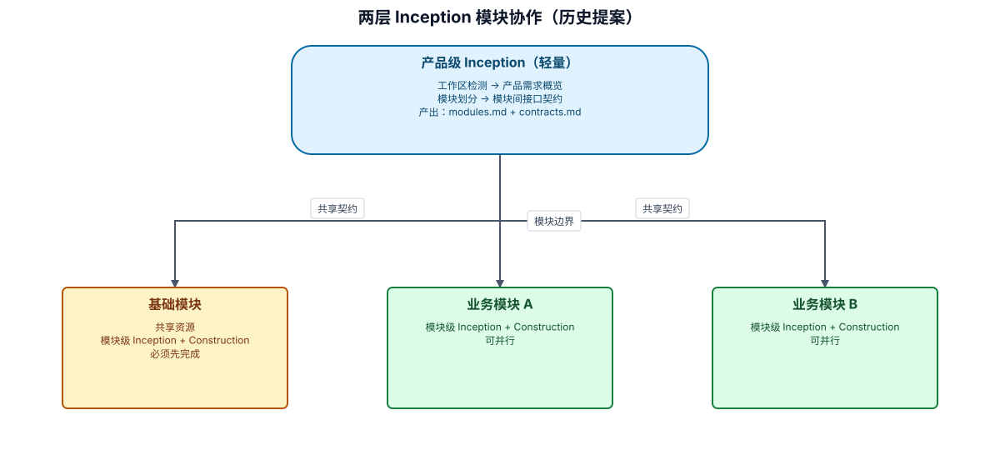

# 模块化 AI-DLC 扩展提案

> **状态**：决策已确认，待实施
> **日期**：2026-05-15
> **目标**：解决"产品必须一个人干"的瓶颈，支持按业务模块并行开发

---

## 1. 问题陈述

### 当前痛点

现有 AI-DLC 的团队协作设计存在根本性瓶颈：

1. **Inception 串行依赖**：需求分析 → 用户故事 → 应用设计 → 单元生成，每一步都依赖前一步的完整产出，无法并行
2. **上下文爆炸**：一个大产品的 Inception 产出物量太大（需求 + 故事 + 设计），单个 AI 会话的上下文窗口装不下
3. **接力模式名存实亡**：虽然设计了 PM → Architect 接力，但 Architect 接手时需要加载全部前置产出物，token 压力巨大
4. **认领模式的前提太重**：必须等整个产品的 Inception 全部完成，才能进入 Construction 认领

### 根本原因

**粒度问题**：当前 Inception 的工作粒度是"整个产品"，而非"单个业务模块"。这导致：
- 产出物体量与产品规模线性增长
- 无法在 Inception 阶段就实现并行
- 团队协作只能在 Construction 阶段才真正生效

---

## 2. 设计目标

| 目标 | 说明 |
|------|------|
| 并行开发 | 不同人/会话可以同时推进不同业务模块 |
| 上下文可控 | 每个会话只需加载"产品级契约 + 本模块产出物" |
| 渐进式 | 不需要一次性规划完所有模块，可以逐步展开 |
| 向后兼容 | 小项目（单模块）的体验与现有流程完全一致 |
| 最小改动 | 复用现有 Inception/Construction 步骤定义，只改组织方式 |

---

## 3. 核心架构：两层 Inception

### 3.1 整体结构



可审阅源：`assets/historical-diagrams.diagram.json`。该图保持本提案中“产品级轻量 Inception、基础模块优先、业务模块可并行”的历史结论。

### 3.2 产品级 Inception

**目的**：确定"有哪些模块"和"模块间怎么交互"，不深入模块内部细节。

**步骤**：

| 步骤 | 说明 | 产出物 |
|------|------|--------|
| 工作区检测 | 与现有一致 | state.md |
| 产品需求概览 | 高层需求梳理，只到模块边界 | product-overview.md |
| 模块划分 | 确定业务模块列表 + 一句话摘要 | modules.md |
| 模块间接口契约 | 定义模块间的 API/事件/数据契约 | contracts.md |

**产出物粒度**：适中
- 模块列表 + 每个模块的一句话需求摘要（给模块级 Inception 方向感）
- 模块间接口契约（让模块可以独立开发而不冲突）
- **不包含**：详细需求、用户故事、组件设计

**预估 token 消耗**：~5-10KB（极轻量）

### 3.3 模块级 Inception + Construction

**目的**：在单个模块范围内走完整的 Inception + Construction 流程。

**步骤**：与现有 Inception/Construction 完全一致，但范围限定在单模块内：
- 模块内需求细化
- 模块内用户故事
- 模块内应用设计
- 模块内单元生成（模块内部可能还有多个单元）
- 模块内 Construction（功能设计 → 代码生成 → 构建测试）

**上下文加载**：
- 产品级产出物（modules.md + contracts.md，~5-10KB）
- 本模块的产出物（~20-40KB）
- **不加载**其他模块的产出物

### 3.4 基础模块（共享资源）

**定义**：承载跨模块共享资源的特殊模块，包括：
- 公共数据模型（如 User、Tenant 等被多模块引用的实体）
- 公共组件/工具类
- 认证/授权基础设施
- 公共配置和常量

**特殊规则**：
- 基础模块**必须先于业务模块完成**（至少完成接口定义）
- 其他模块依赖基础模块的接口契约
- 基础模块的接口变更需要通知所有依赖模块

---

## 4. 入口与导航

### 4.1 统一入口 + 菜单选择

启动方式不变：`使用 AI-DLC，[描述需求]`

AI 根据工作区状态自动判断展示什么：

**场景 A：全新项目（无 state.md）**
→ 询问协作模式 → 进入产品级 Inception

**场景 B：产品级 Inception 已完成（有 modules.md）**
→ 展示模块菜单：

```markdown
**检测到已完成产品级规划。**

**模块状态：**
| 模块 | 类型 | 状态 | 进度 |
|------|------|------|------|
| base-infrastructure | 基础 | ✅ Inception 完成 | Construction 3/5 |
| user-management | 业务 | 🔄 Inception 进行中 | 需求分析 |
| order-management | 业务 | 🔓 未开始 | - |
| payment | 业务 | 🔓 未开始 | - |

**你想做什么？**

A) 继续产品规划 — 修改模块划分或接口契约
B) 进入「base-infrastructure」— 继续 Construction
C) 进入「user-management」— 继续 Inception
D) 进入「order-management」— 开始模块级 Inception
E) 进入「payment」— 开始模块级 Inception

[回答]:
```

**场景 C：已在某模块内工作（state.md 记录了活跃模块）**
→ 直接恢复到该模块的上次中断处

### 4.2 模块间切换

用户可以在任何时候说"切换到模块 X"，AI 会：
1. 保存当前模块的进度到 state.md
2. 卸载当前模块的上下文
3. 加载目标模块的上下文
4. 从目标模块的上次中断处继续

---

## 5. 目录结构

### 5.1 新目录结构

```
docs/aidlc/
├── product/                          # 产品级 Inception 产出物
│   ├── product-overview.md           # 产品需求概览
│   ├── modules.md                    # 模块划分 + 一句话摘要
│   ├── contracts.md                  # 模块间接口契约
│   ├── decision-summary.md           # 产品级决策摘要
│   └── audit-product.md              # 产品级审计日志
│
├── modules/                          # 各模块独立目录
│   ├── base-infrastructure/          # 基础模块
│   │   ├── inception/
│   │   │   ├── requirements/
│   │   │   ├── user-stories/
│   │   │   ├── application-design/
│   │   │   └── plans/
│   │   ├── construction/
│   │   │   ├── {unit-name}/
│   │   │   └── build-and-test/
│   │   └── audit-module.md
│   │
│   ├── user-management/              # 业务模块
│   │   ├── inception/
│   │   │   ├── requirements/
│   │   │   ├── user-stories/
│   │   │   ├── application-design/
│   │   │   └── plans/
│   │   ├── construction/
│   │   │   ├── {unit-name}/
│   │   │   └── build-and-test/
│   │   └── audit-module.md
│   │
│   └── order-management/             # 业务模块
│       └── ...（同上）
│
├── state.md                          # 全局状态（含模块进度总览）
└── audit-summary.md                  # 极简审计摘要
```

### 5.2 与现有结构的对比

| 现有结构 | 新结构 | 说明 |
|----------|--------|------|
| `docs/aidlc/inception/` | `docs/aidlc/modules/{name}/inception/` | 按模块隔离 |
| `docs/aidlc/construction/` | `docs/aidlc/modules/{name}/construction/` | 按模块隔离 |
| 无 | `docs/aidlc/product/` | 新增产品级产出物 |
| `state.md`（单一进度） | `state.md`（模块进度矩阵） | 扩展 |

### 5.3 单模块项目的退化

如果产品级 Inception 判断只有 1 个模块（小项目），自动退化为现有结构：
- 不创建 `modules/` 目录
- 直接使用 `docs/aidlc/inception/` 和 `docs/aidlc/construction/`
- 体验与现有流程完全一致

---

## 6. state.md 扩展

### 6.1 新增字段

```markdown
# AI-DLC 状态跟踪

## 项目信息
- **项目类型**：[全新项目/存量项目]
- **协作模式**：[单人模式/团队协作]
- **架构模式**：[单模块/多模块]
- **开始日期**：[ISO 时间戳]
- **当前层级**：[产品级/模块级]
- **活跃模块**：[模块名称，仅多模块时]

## 产品级进度（仅多模块）
| 步骤 | 状态 | 完成时间 |
|------|------|----------|
| 工作区检测 | ✅ 完成 | [时间] |
| 产品需求概览 | ✅ 完成 | [时间] |
| 模块划分 | ✅ 完成 | [时间] |
| 模块间接口契约 | ✅ 完成 | [时间] |

## 模块进度总览（仅多模块）
| 模块 | 类型 | Inception | Construction | 状态 |
|------|------|-----------|--------------|------|
| base-infrastructure | 基础 | ✅ 完成 | 3/5 单元 | 🔄 进行中 |
| user-management | 业务 | 🔄 需求分析 | - | 🔄 进行中 |
| order-management | 业务 | ⏳ 未开始 | - | 🔓 可开始 |
| payment | 业务 | ⏳ 未开始 | - | 🚫 依赖 base |

## 模块依赖
| 模块 | 依赖 | 可开始条件 |
|------|------|-----------|
| base-infrastructure | 无 | 随时 |
| user-management | base（接口） | base 接口已定义 |
| order-management | base（接口） | base 接口已定义 |
| payment | base（接口）, order（事件） | base + order 接口已定义 |
```

---

## 7. 产品级 Inception 详细设计

### 7.1 产品需求概览

**目的**：快速梳理产品的高层需求，只到"这个产品要做哪些大块事情"的粒度。

**产出物格式**（`product-overview.md`）：

```markdown
# 产品需求概览

## 产品定位
[一段话描述产品是什么、给谁用、解决什么问题]

## 核心业务域
| 业务域 | 说明 | 优先级 |
|--------|------|--------|
| 用户管理 | 注册、登录、权限、组织架构 | P0 |
| 订单管理 | 下单、支付、退款、物流 | P0 |
| 商品管理 | 商品发布、分类、库存 | P1 |
| ... | ... | ... |

## 全局约束
- [技术约束]
- [业务约束]
- [时间约束]

## 非功能需求概要
- 性能：[一句话]
- 安全：[一句话]
- 可用性：[一句话]
```

**交互方式**：
- AI 根据用户描述生成初稿
- 用户确认或修改
- 不做深入的需求细化（那是模块级的事）

### 7.2 模块划分

**目的**：确定业务模块列表，每个模块一句话描述其职责边界。

**产出物格式**（`modules.md`）：

```markdown
# 模块划分

## 模块列表

### 基础模块

| 模块 | 职责 | 包含内容 |
|------|------|---------|
| base-infrastructure | 跨模块共享的基础设施 | 公共实体、认证、权限、工具类 |

### 业务模块

| 模块 | 职责 | 一句话需求摘要 | 优先级 |
|------|------|---------------|--------|
| user-management | 用户全生命周期管理 | 支持注册、登录、组织架构、角色权限配置 | P0 |
| order-management | 订单全流程管理 | 支持下单、支付、退款、物流跟踪 | P0 |
| product-catalog | 商品信息管理 | 支持商品发布、分类管理、库存管理 | P1 |

## 模块边界规则
- [规则1：如何判断一个功能属于哪个模块]
- [规则2：跨模块功能的归属原则]

## 开发顺序建议
1. base-infrastructure（其他模块的前置）
2. user-management（大多数模块依赖用户体系）
3. product-catalog / order-management（可并行）
```

**划分原则**：
- 按业务域划分，不按技术层划分
- 每个模块应该能独立交付价值
- 模块间依赖尽量单向
- 基础模块承载所有共享资源

### 7.3 模块间接口契约

**目的**：定义模块间的交互方式，让各模块可以独立开发。

**产出物格式**（`contracts.md`）：

```markdown
# 模块间接口契约

## 契约总览

```text
base-infrastructure
    ↑ 依赖
    ├── user-management
    ├── order-management ←── product-catalog（商品查询）
    └── payment ←── order-management（支付请求）
```

## 契约定义

### base → 所有模块

**提供**：
- `AuthService`：认证/授权接口
- `BaseEntity`：公共实体基类
- `TenantContext`：多租户上下文

### user-management → order-management

**接口**：
- `UserQueryService.getUser(userId): UserDTO` — 查询用户信息
- `UserQueryService.checkPermission(userId, resource): boolean` — 权限校验

**事件**：
- `UserCreatedEvent` — 用户创建后通知
- `UserDisabledEvent` — 用户禁用后通知

### order-management → payment

**接口**：
- `PaymentService.createPayment(orderId, amount): PaymentResult` — 发起支付

**事件**：
- `PaymentCompletedEvent` — 支付完成通知
- `RefundCompletedEvent` — 退款完成通知

## 契约规则
- 模块间只通过定义的接口/事件通信
- 禁止直接访问其他模块的数据库表
- 接口变更需要通知所有消费方模块
```

---

## 8. 团队协作模型变化

### 8.1 现有模型 vs 新模型

| 维度 | 现有模型 | 新模型 |
|------|----------|--------|
| 并行粒度 | Construction 阶段的单元 | 模块级（Inception + Construction 都可并行） |
| 协作方式 | 接力 + 认领 | 产品级协商 + 模块级独立 |
| 上下文隔离 | 同一产出物，按需加载 | 物理隔离，各模块独立目录 |
| 冲突风险 | 高（共享 Inception 产出物） | 低（模块间只通过契约交互） |

### 8.2 新的协作流程

```
产品级 Inception（团队一起，1-2 次会话）
    │
    │  确定模块划分和接口契约
    │
    ├── 开发者 A：base-infrastructure（独立会话）
    ├── 开发者 B：user-management（独立会话）
    ├── 开发者 C：order-management（独立会话）
    └── 开发者 D：payment（等 base 接口定义完成后开始）
```

### 8.3 与现有团队协作的关系

- **接力模式**：仍然适用于产品级 Inception（PM 做概览，Architect 做模块划分和契约）
- **认领模式**：从"认领单元"升级为"认领模块"（粒度更大，更独立）
- **模块内部**：如果单个模块足够大，模块内部仍然可以用现有的单元认领机制

---

## 9. Token 管理影响

### 9.1 上下文消耗对比

**现有方案（大产品，10 个单元）**：

```
恢复到 Construction unit-5：
- core-workflow.md: ~15KB
- state.md: ~5KB
- audit-summary.md: ~2KB
- 全局需求切片: ~3KB
- 全局故事切片: ~2KB
- 全局设计切片: ~3KB
- shared-interfaces.md: ~5KB
- 当前单元设计: ~3KB
- 当前步骤 steering: ~8KB
总计: ~46KB
```

**新方案（同样规模，3 个模块，每模块 3-4 个单元）**：

```
恢复到模块 B 的 Construction unit-2：
- core-workflow.md: ~15KB
- state.md: ~3KB（只看模块进度）
- audit-summary.md: ~2KB
- product/contracts.md: ~3KB（模块间契约）
- 模块 B 的需求: ~3KB（只有本模块的）
- 模块 B 的故事: ~2KB
- 模块 B 的设计: ~3KB
- 当前单元设计: ~3KB
- 当前步骤 steering: ~8KB
总计: ~42KB
```

**关键区别**：新方案的上下文消耗不随产品规模增长，只与当前模块的复杂度相关。

### 9.2 新增的加载策略

在现有策略 A-E 基础上，新增：

**策略 F：模块隔离加载**

| 加载时机 | 加载内容 |
|----------|---------|
| 产品级工作 | product/ 目录下的产出物 |
| 模块级工作 | product/contracts.md + modules/{name}/ 下的产出物 |
| 模块切换 | 卸载旧模块上下文，加载新模块上下文 |

**禁止**：
- ❌ 在模块 A 的会话中加载模块 B 的产出物
- ❌ 在模块级工作时加载 product-overview.md（只需 contracts.md）

---

## 10. 工作流变更清单

### 10.1 需要新增的 Steering 文件

| 文件 | 说明 |
|------|------|
| `product-inception.md` | 产品级 Inception 的步骤定义 |
| `product-module-division.md` | 模块划分的规则和问题模板 |
| `product-contracts.md` | 接口契约的定义规范 |

### 10.2 需要修改的 Steering 文件

| 文件 | 修改内容 |
|------|---------|
| `core-workflow.md` | 新增产品级 Inception 流程；模块级入口逻辑 |
| `inception-workspace-detection.md` | 新增多模块检测和菜单展示逻辑 |
| `common-team-collaboration.md` | 新增模块级协作模型 |
| `common-token-management.md` | 新增策略 F（模块隔离加载） |
| `common-session-continuity.md` | 新增模块切换的恢复逻辑 |

### 10.3 不需要修改的文件

以下文件在模块级 Inception/Construction 中原样复用：
- `inception-requirements-analysis.md`
- `inception-user-stories.md`
- `inception-application-design.md`
- `inception-units-generation.md`
- `construction-*.md`（所有 Construction 步骤）
- `common-quality-gates.md`
- `common-content-validation.md`

---

## 11. 向后兼容策略

### 11.1 自动退化条件

当满足以下任一条件时，自动退化为现有单模块流程：
- 产品级 Inception 判断只有 1 个业务模块
- 用户明确选择"单模块模式"
- 检测到现有的 `docs/aidlc/inception/` 目录（旧项目）

### 11.2 旧项目迁移

不强制迁移。旧项目继续使用现有目录结构，新项目默认使用模块化结构（如果有多模块）。

---

## 12. 设计决策（已确认）

### Q1：模块间接口变更的通知机制

**决策：在 contracts.md 中标记变更，各模块恢复时检查**

实现方式：
- contracts.md 中增加 `## 变更日志` 区域
- 每次接口变更时追加记录（时间、变更内容、影响模块）
- 各模块恢复时，AI 自动对比 contracts.md 的变更日志与本模块上次同步时间
- 如有未同步的变更，提示用户确认影响

### Q2：模块划分的时机

**决策：允许渐进式划分，后续可以新增模块**

实现方式：
- 产品级 Inception 不要求一次性列出所有模块
- modules.md 支持追加新模块（标记添加时间）
- 新增模块时需要同步更新 contracts.md（定义与现有模块的接口）
- state.md 中新模块初始状态为"⏳ 未开始"

### Q3：跨模块功能的处理

**决策：在主导模块中处理，其他模块只实现接口**

实现方式：
- 跨模块功能归属于"发起方"模块（如"用户下单"归属 order-management）
- 主导模块的 Inception 中定义完整业务流程
- 被调用模块只需在 contracts.md 中暴露接口，不需要了解调用方的业务逻辑
- 主导模块的用户故事中标注"依赖模块 X 的接口 Y"

### Q4：基础模块的完成标准

**决策：只需 Inception 完成（接口已定义），Construction 可以和业务模块并行**

实现方式：
- 基础模块的 Inception 必须先于业务模块完成（接口契约是业务模块的前置）
- 基础模块的 Construction 可以和业务模块的 Inception/Construction 并行
- 业务模块在开发时，如果基础模块的代码尚未完成，可以 mock 接口
- 基础模块 Construction 完成后，业务模块在集成测试阶段验证真实调用
---

## 13. 实施路线图

### Phase 1：设计验证
- [ ] 确认开放问题的答案
- [ ] 用一个实际项目验证目录结构和流程

### Phase 2：Steering 文件编写
- [ ] 编写 `product-inception.md`
- [ ] 编写 `product-module-division.md`
- [ ] 编写 `product-contracts.md`
- [ ] 修改 `core-workflow.md`
- [ ] 修改 `inception-workspace-detection.md`

### Phase 3：集成测试
- [ ] 修改 `common-team-collaboration.md`
- [ ] 修改 `common-token-management.md`
- [ ] 修改 `common-session-continuity.md`
- [ ] 端到端测试：产品级 → 模块级 → Construction

### Phase 4：三版本同步
- [ ] 同步到 cc-aidlc（Claude Code 版本）
- [ ] 同步到 oc-aidlc（OpenCode 版本）
