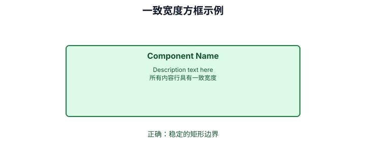
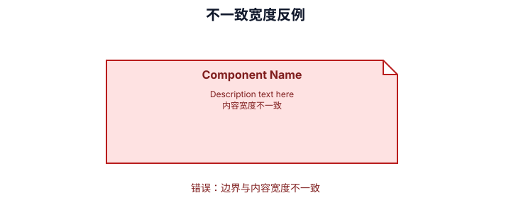
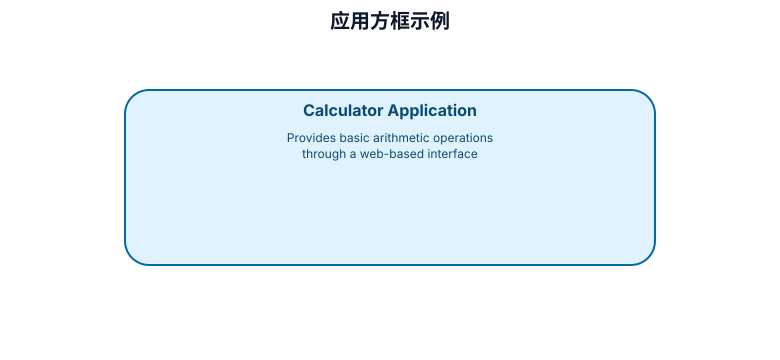
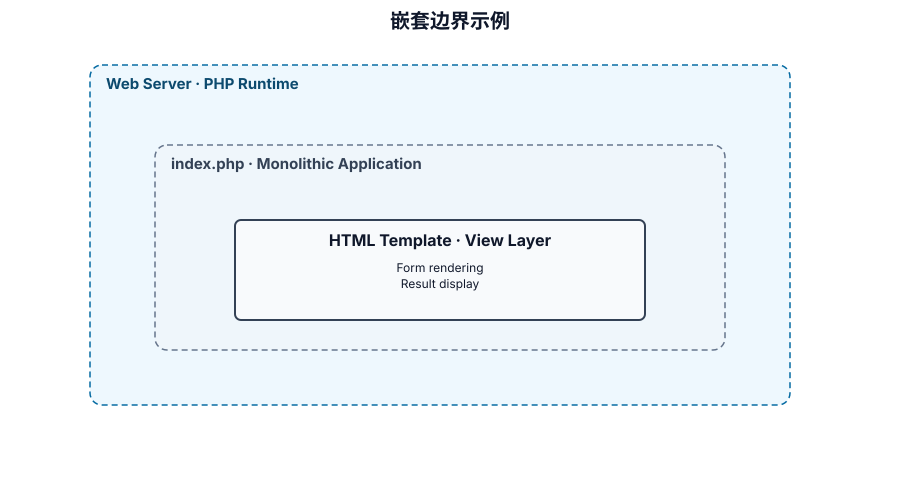
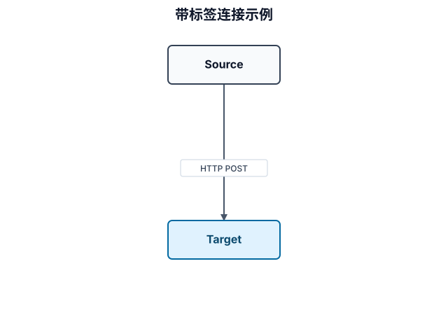
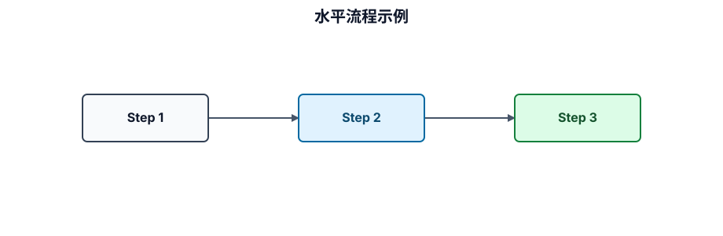
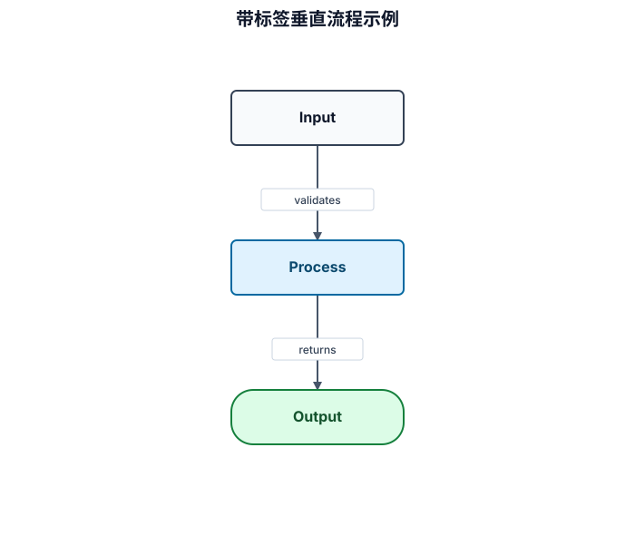

# 二维文本图遗留兼容说明

## 定位

二维 ASCII/Unicode 图不再是本仓的新图表交付格式。新图表遵循 Blueprinter SVG 设计规则，使用可审阅的 SVG 源和可选语义伴随清单；静态 SVG、预览和导出由外部 Provider 按目标要求完成，规则见 `common-diagram-design-standards.md` 与 `common-svg-diagram-standards.md`。

目录树、命令、单行状态、短线性步骤和需要复制粘贴的文本仍保持普通 Markdown / fenced text；只有表达真实二维关系的旧文本图才迁移。

## 已迁移的历史图型

### 一致宽度方框与反例

### 应用与嵌套边界

### 连接与流程

上述 SVG 的结构化源位于 `assets/diagram-library.diagram.json`。它们仅说明图型语义和迁移边界，不能替代项目事实。

## 迁移规则

1. 确认文本块包含节点、边、层级或分支等二维图表语义；
2. 将可验证的节点、关系、分组和标签按 Blueprinter 规则录入 SVG 源；需要机器检查时再创建 `.diagram.json` 语义伴随清单；
3. 以 SVG 源引用或 Provider 实际生成的目标产物引用替换图块；引用不证明目标环境已完成渲染；
4. 保留正文中无法在图像加载失败时省略的解释；
5. 文本不是图、事实不足或不适合图型时，保持文本而非制造 SVG。
