# Mermaid 遗留语法迁移映射

## 定位

本文件不再定义可用于新产物的 Mermaid 代码。保留该文件名是为了让历史链接和旧调用可追溯；新图表一律按 Blueprinter SVG 设计规则生成 `common-svg-diagram-standards.md` 规定的 SVG 源，可选生成语义伴随清单；静态目标交付由外部 Provider 负责。

## 历史图型到 SVG 场景的映射

### 流程图

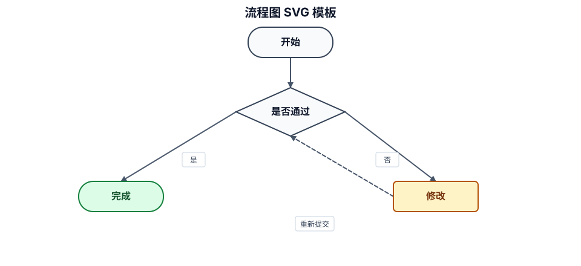

### 交付型业务流程

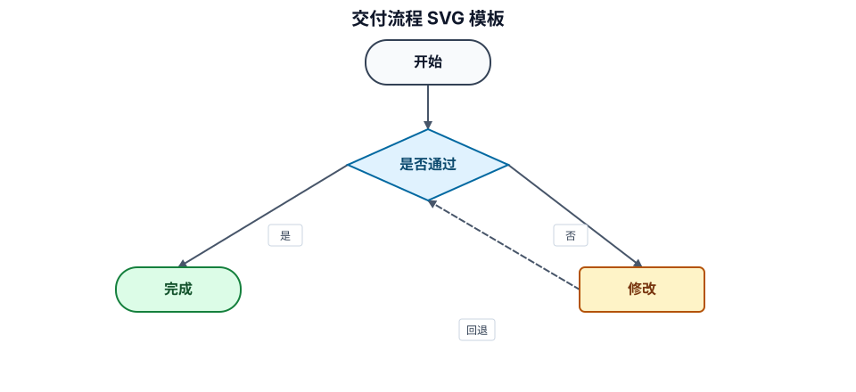

### 时序图

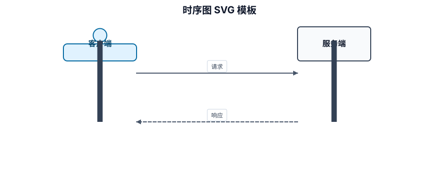

### 状态图

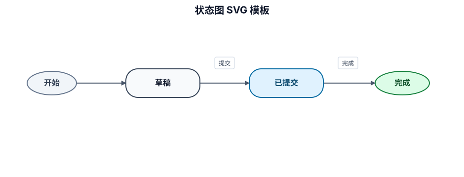

### ER 图

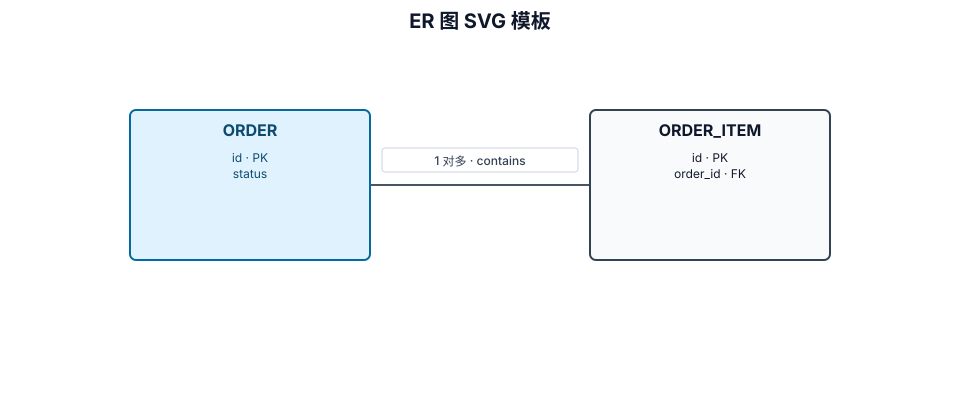

### 类图

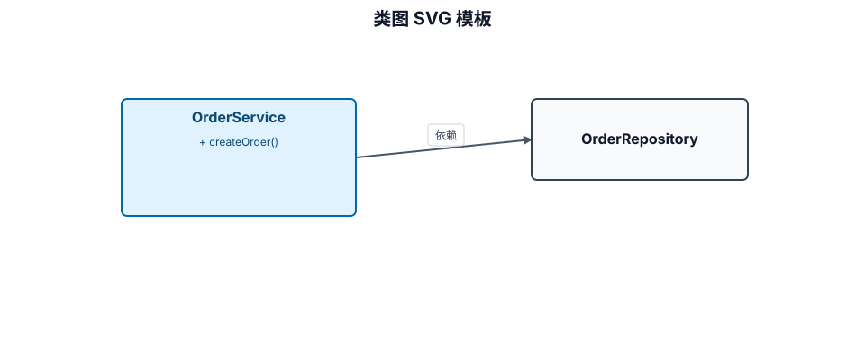

### 系统上下文

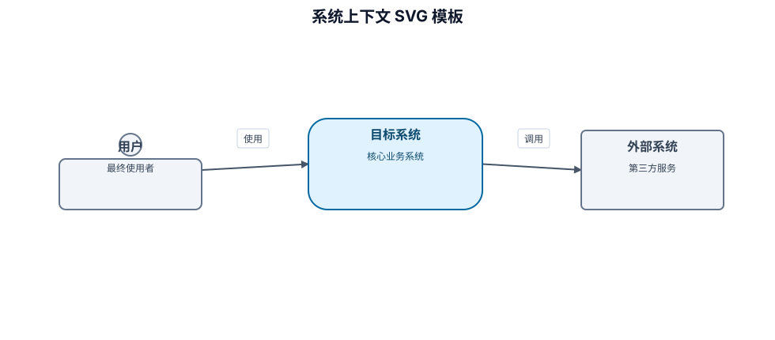

### 容器架构

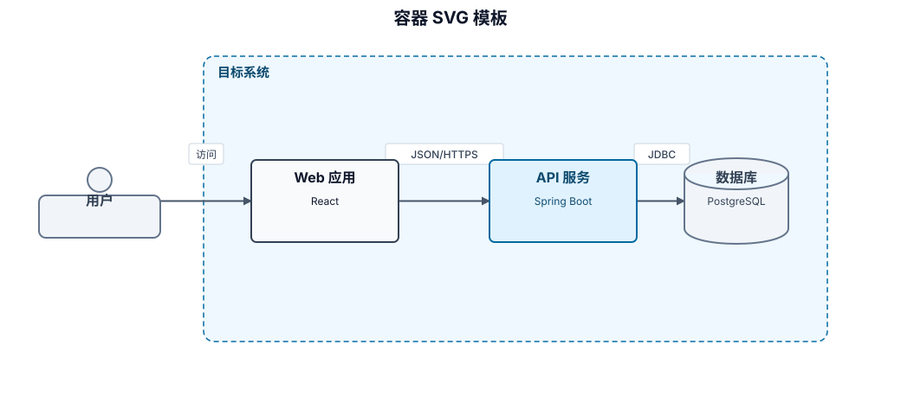

### 组件架构

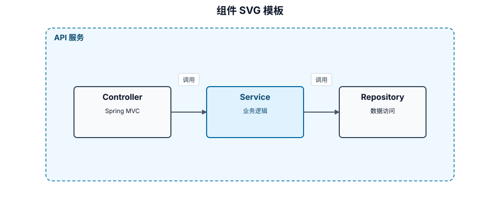

### 部署拓扑

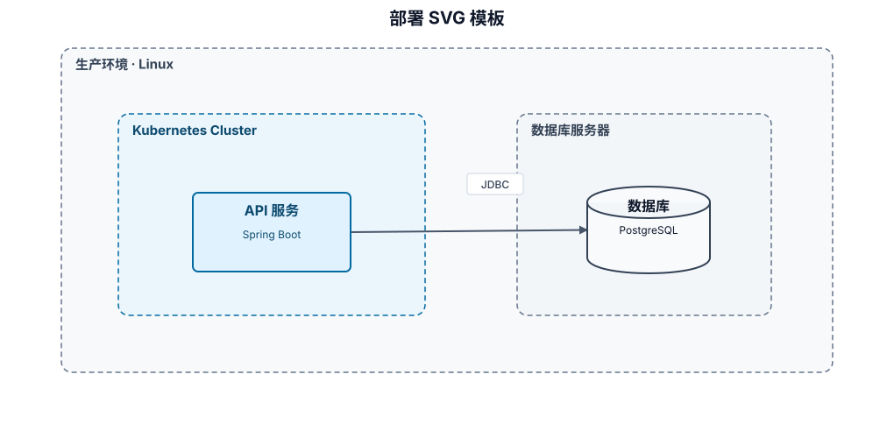

### 基础设施关系

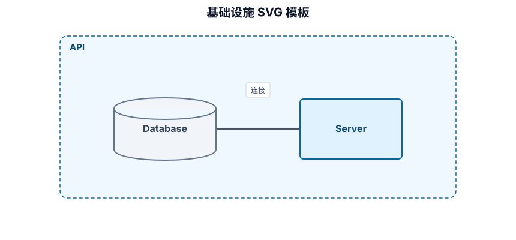

全部模板的可审阅源位于 `assets/diagram-library.diagram.json`。实际项目图必须从已批准事实派生，不能把模板中的示例系统、技术栈或关系复制为项目事实。

## 遗留迁移检查

- 提取稳定节点 ID、展示文本、关系方向、分组和连线标签；
- 确认语义与相邻正文一致，不增加未批准的实体或关系；
- 先完成 SVG 源和可选语义清单的事实、结构、方向、端口、连通性与几何约束检查；若目标要求静态 SVG、预览或导出，再由外部 Provider 执行目标渲染并记录其能力和验收证据；
- 遇到只有单行状态、目录树、命令或无法确认关系的文本时保留文本，不强行制图。
